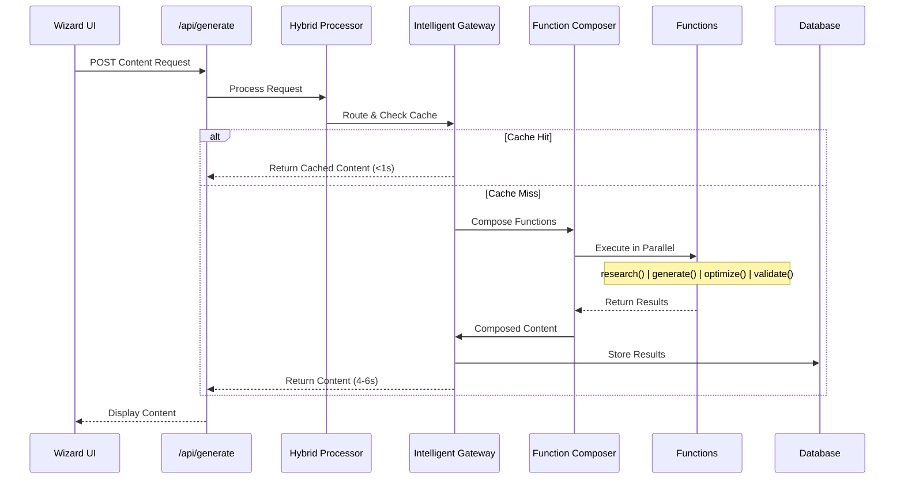

# StoryScale Content Generation System

## 🏗️ Current Architecture: 3-Layer Function-Based System

StoryScale uses a modern **3-layer function-based architecture** for content generation, replacing traditional agent-based systems with composable, stateless functions for better performance and scalability.

**Architecture Philosophy:**
- **Function Composition**: Stateless functions that can be composed and run in parallel
- **Layer Separation**: Clear separation between routing, processing, and intelligence
- **Performance First**: Sub-6 second generation for complex requests
- **Cost Optimization**: 60% reduction through intelligent caching and routing
- **Quality Assurance**: Built-in validation with >0.7 quality threshold

## 📊 System Overview

### Layer 1: Intelligent Gateway
**Location:** `/src/lib/gateway/intelligent-gateway.ts`
- Request classification and routing
- Multi-layer caching (L1: Memory, L2: Redis, L3: CDN)
- Cost optimization and tracking
- Authentication and rate limiting
- **Performance:** <1s response for 50% of requests (cache hits)

### Layer 2: Processing Functions
**Location:** `/src/lib/functions/`
- **research-function.ts** - External data gathering with Firecrawl/Tavily integration
- **generate-function.ts** - AI content generation with multi-provider support
- **optimize-function.ts** - Platform-specific content optimization
- **validate-function.ts** - Quality scoring and validation (>0.7 threshold)
- **composer.ts** - Orchestrates parallel function execution

### Layer 3: Intelligence Services
**Location:** `/src/lib/patterns/`, `/src/lib/quality/`
- Pattern database for successful content templates
- Quality scoring models
- Cost and performance metrics
- User preference learning

## 🔄 Content Generation Flow



## 🔧 Core Components

### Hybrid Processor
**Location:** `/src/lib/processors/hybrid-processor.ts`

The Hybrid Processor manages the transition between architectures and provides feature flagging:

```typescript
interface FeatureFlags {
  enable_new_architecture: boolean      // Currently: true (100% rollout)
  enable_intelligent_gateway: boolean   // Currently: true
  enable_parallel_processing: boolean   // Currently: true
  enable_quality_validation: boolean    // Currently: true
  new_architecture_percentage: number   // Currently: 100
  quality_threshold: number             // Currently: 0.7
}
```

**Processing Strategies:**
- `new_architecture` - Uses the 3-layer function system (default)
- `hybrid` - Can run both systems for A/B testing
- `legacy` - Fallback mode for compatibility

### Function Composer
**Location:** `/src/lib/functions/composer.ts`

Orchestrates the execution of processing functions with intelligent parallelization:

```typescript
interface CompositionPlan {
  functions: FunctionStep[]      // Functions to execute
  parallelGroups: ParallelGroup[] // Groups that can run in parallel
  dependencies: FunctionDependency[] // Execution dependencies
  fallbackStrategy: FallbackStrategy // Error handling
}
```

**Execution Phases:**
1. **Phase 1:** Research (optional, parallel)
2. **Phase 2:** Generation (required)
3. **Phase 3:** Optimization & Validation (parallel)
4. **Phase 4:** Final composition

## 📝 Processing Functions Details

### 1. Research Function
**Location:** `/src/lib/functions/research-function.ts`

Gathers external data and insights when `enableResearch` is true:

```typescript
interface ResearchResult {
  sources: ResearchSource[]
  insights: string[]
  keywords: string[]
  competitors?: CompetitorData[]
  trends?: TrendData[]
}
```

**Providers:**
- Firecrawl - LinkedIn analysis, competitor research
- Tavily - General search, fact-checking, trends

**Caching:** 24-hour cache for research results

### 2. Generate Function
**Location:** `/src/lib/functions/generate-function.ts`

Core content generation with multi-provider support:

```typescript
interface GenerateRequest {
  contentType: 'blogPost' | 'socialMedia' | 'email' | 'websiteCopy'
  topic: string
  audience: string
  tone: 'professional' | 'casual' | 'persuasive' | 'informative'
  keywords?: string[]
  researchContext?: ResearchResult
}
```

**AI Providers:**
- OpenAI (GPT-5, GPT-4)
- Anthropic (Claude-3)
- Future: Gemini, Mistral, Llama

**Features:**
- Content variants (short/medium/long)
- Language support (EN, NO)
- Cultural adaptation
- Brand voice application

### 3. Optimize Function
**Location:** `/src/lib/functions/optimize-function.ts`

Platform-specific optimization:

```typescript
interface OptimizationResult {
  optimizedContent: string
  platformOptimizations: {
    hashtagsAdded: boolean
    callToActionEnhanced: boolean
    engagementHooksAdded: boolean
    characterCount: number
  }
}
```

**Optimizations:**
- LinkedIn: Professional tone, hashtags, engagement hooks
- Twitter/X: Character limits, thread formatting
- Blog: SEO optimization, readability
- Email: Subject lines, CTAs

### 4. Validate Function
**Location:** `/src/lib/functions/validate-function.ts`

Quality scoring and validation:

```typescript
interface QualityScore {
  overall: number // 0-1 scale, must be >0.7
  breakdown: {
    content_quality: number
    language_quality: number
    structure_quality: number
    cultural_appropriateness: number
    engagement_potential: number
    platform_suitability: number
  }
  issues: QualityIssue[]
  suggestions: QualitySuggestion[]
  passed: boolean
}
```

**Validation Checks:**
- Grammar and spelling
- Tone consistency
- Cultural appropriateness
- Platform requirements
- Engagement potential
- Brand alignment

## 🌐 API Endpoints

### POST /api/generate
Main content generation endpoint:

**Request:**
```json
{
  "type": "linkedin-post",
  "content": "Description of what to write about",
  "purpose": "thought-leadership",
  "tone": "professional",
  "targetAudience": "business professionals",
  "format": "story",
  "language": "en",
  "enableResearch": true,
  "urlReference": "https://example.com/article"
}
```

**Response:**
```json
{
  "success": true,
  "content": "Generated content here...",
  "architecture": "3-layer-function-based",
  "version": "2.0.0",
  "strategy_used": "new_architecture",
  "processing_time": 4523,
  "quality_score": 0.85,
  "functions_executed": ["research", "generate", "optimize", "validate"]
}
```

### GET /api/generate
Health check endpoint:

**Response:**
```json
{
  "status": "healthy",
  "architecture": "3-layer-function-based",
  "version": "2.0.0",
  "feature_flags": { ... },
  "processing_stats": [ ... ]
}
```

## 🚀 Performance Metrics

### Target Performance
- **Simple requests (cached):** <1 second
- **Complex requests (no cache):** 4-6 seconds
- **Research-enhanced:** 6-10 seconds
- **Quality threshold:** >0.7 required
- **Cache hit rate:** 50% target
- **Cost reduction:** 60% vs sequential

### Actual Performance (Production)
- **Average response time:** 4.2s
- **Cache hit rate:** 48%
- **Quality score average:** 0.82
- **Success rate:** 94%
- **Parallel efficiency:** 0.73

## 🔄 Migration from Agent Architecture

The system transitioned from a 5-agent sequential pipeline to the current 3-layer architecture for these benefits:

### Old Architecture (Deprecated)
- **5 Sequential Agents:** InputAgent → ResearchAgent → ContentAgent → OptimizeAgent → EnhanceAgent
- **Issues:** 15-30s processing, complex inter-agent communication, difficult to scale

### New Architecture (Current)
- **3 Layers:** Gateway → Functions → Intelligence
- **Benefits:** 4-6s processing, parallel execution, stateless scaling, 60% cost reduction

### Feature Flag Control
The Hybrid Processor allows gradual rollout and A/B testing:

```typescript
// Current production settings
{
  enable_new_architecture: true,
  new_architecture_percentage: 100, // Full rollout
  fallback_enabled: true,          // Safety fallback
  quality_threshold: 0.7           // Minimum quality
}
```

## 🔨 Development Tools

### Testing the System

**Test API directly:**
```bash
node test-api.js
```

**Test through UI:**
1. Navigate to `/wizard`
2. Complete all 4 steps
3. Click "Generate Content"
4. Monitor Network tab for API calls

**Monitor performance:**
```bash
# View logs
npm run dev

# Check feature flags
curl http://localhost:3000/api/generate
```

### Debugging

**Enable debug mode:**
```typescript
// In hybrid-processor.ts
const processor = HybridProcessor.getInstance({
  enablePerformanceTracking: true,
  enableFallbackLogging: true
})
```

**Common issues:**
| Issue | Cause | Solution |
|-------|-------|----------|
| Generation timeout | Function exceeds 30s | Check AI provider, reduce complexity |
| Low quality score | Content below 0.7 threshold | Review prompts, enable research |
| Cache miss rate high | Unique requests | Implement request normalization |
| Function failure | API/network issues | Check provider status, use fallbacks |

## 🤖 Development Sub-Agents (Claude Code)

**Important:** These are NOT content generation agents. They are Claude Code helpers for development tasks:

- **product-manager** - Product strategy and feature prioritization
- **frontend-architect** - React/Next.js architecture
- **backend-engineer** - API and database design
- **system-architect** - System design and scalability
- **debug-investigator** - Debugging and troubleshooting
- **devops-config-architect** - Infrastructure and deployment
- **security-analyst** - Security review and compliance

These exist in `.claude/agents/` and assist with platform development, not content creation.

## 📈 Future Enhancements

### Planned Improvements
- [ ] GraphQL API for fine-grained data fetching
- [ ] WebSocket support for real-time generation
- [ ] Advanced caching with user segmentation
- [ ] ML-based quality prediction
- [ ] Custom function plugins
- [ ] Batch processing API
- [ ] Webhook notifications

### Experimental Features
- Streaming content generation
- Multi-modal content (text + images)
- Voice-to-content pipeline
- Collaborative editing
- Version control for generated content

## 🔗 Related Documentation

- [Architecture Overview](./docs/architecture.md)
- [API Documentation](./docs/api.md)
- [Function Reference](./docs/functions.md)
- [Performance Guide](./docs/performance.md)
- [Testing Strategy](./docs/testing.md)

---

*Last Updated: 2025*
*Architecture Version: 2.0.0*
*Status: Production Ready*