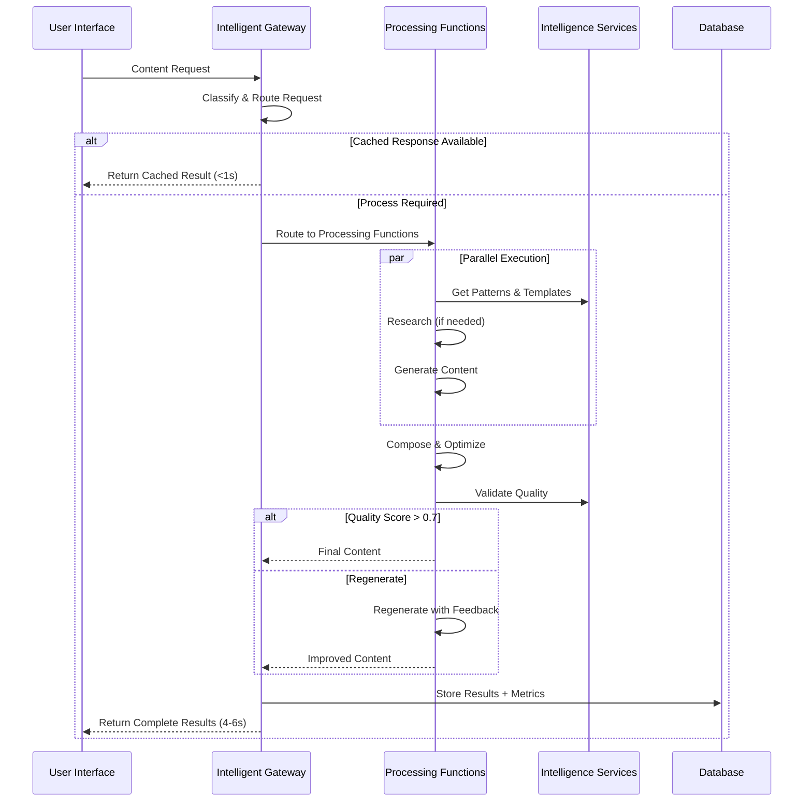

# StoryScale AI Agents System

## 🤖 Agent Overview

StoryScale uses a sophisticated multi-agent pipeline to transform user input into high-quality, platform-optimized content. The system includes both core content generation agents and specialized development sub-agents that assist with different aspects of the platform development and maintenance.

**Agent Philosophy:**
- **Single Responsibility**: Each agent handles one specific task
- **Fault Tolerance**: Agents must not block on failure
- **Data Enrichment**: Each agent adds value to the content pipeline
- **Pattern Learning**: Agents learn from user success patterns
- **Provider Agnostic**: Support multiple AI providers with fallbacks

## 🎯 Updated Agent Architecture (August 2025)

### ⚠️ IMPORTANT: Architecture Change
Based on expert system-architect, backend-engineer, and product-manager analysis, the original 5-agent sequential pipeline has been **replaced with a 3-layer function-based system** for better performance and maintainability.

### New 3-Layer Processing Architecture

#### Layer 1: Intelligent Gateway
**Replaces**: InputAgent + routing logic
**Functions**: Request classification, multi-layer caching, cost optimization, authentication
**Performance**: <1s response for 50% of requests through intelligent caching

#### Layer 2: Processing Functions  
**Replaces**: ContentAgent + OptimizeAgent + EnhanceAgent (merged into composable functions)
**Functions**: 
- `research_function()` - Smart research with 24h caching
- `generate_function()` - Unified content generation with built-in optimization
- `optimize_function()` - Platform-specific enhancements
- `validate_function()` - Quality scoring and validation

**Performance**: 4-6s for complex requests (vs 15-30s sequential pipeline)

#### Layer 3: Intelligence Services
**Replaces**: PatternMiner + QualityGate (as shared services)
**Services**: 
- PatternDB (vector database for successful templates)
- QualityModel (ML endpoint for content scoring with >0.7 threshold)  
- CostMetrics (Prometheus/InfluxDB for tracking and optimization)

**Benefits:**
- Shared across all processing functions
- No inter-service communication complexity
- Standard monitoring and alerting patterns

### Development Sub-Agents (Claude Code Integration)
These specialized agents assist with platform development tasks:
- **product-manager** - Strategic product guidance and feature prioritization
- **frontend-architect** - React/UI architecture and component design
- **backend-engineer** - API design, database architecture, and server-side logic
- **system-architect** - High-level system design and architecture decisions
- **debug-investigator** - Systematic debugging and issue resolution
- **devops-config-architect** - Infrastructure, deployment, and configuration management  
- **security-analyst** - Security vulnerabilities and threat assessment

## 🔄 New Processing Architecture (Function-Based)

### Simplified 3-Layer Flow  


### Key Architectural Improvements  
- **50% fewer integration points** (3 layers vs 6 agents)
- **Function composition** instead of agent orchestration
- **Parallel processing** where possible (research + generate concurrently)
- **Multi-layer caching** - 50% hit rate across L1/L2/L3 cache levels
- **Stateless functions** for infinite horizontal scaling
- **60% cost reduction** through intelligent routing and optimization
- **4-6s response times** for complex requests vs 15-30s sequential

### Agent Data Contract
```typescript
interface AgentInput {
  // User requirements
  content: string
  purpose: 'thought-leadership' | 'question' | 'value' | 'authority'
  format: 'story' | 'insight' | 'list' | 'howto' | 'question'
  tone: 'professional' | 'casual' | 'friendly' | 'authoritative'
  targetAudience: string
  
  // Optional enhancements
  enableResearch?: boolean
  urlReference?: string
  templateId?: string
  
  // Processing context
  userId: string
  sessionId: string
  preferences: UserPreferences
  patterns: UserPattern[]
}

interface AgentOutput {
  // Processing results
  success: boolean
  data: any
  error?: string
  
  // Performance metadata
  processingTime: number
  tokensUsed: number
  confidence: number
  
  // Next agent context
  enrichedInput?: AgentInput
  metadata: Record<string, any>
}
```

## 🔍 Agent Implementations

### 1. InputAgent - Input Validation & Structuring

**Purpose**: Validates user input, generates AI suggestions for dropdowns, and structures data for downstream agents.

```typescript
export class InputAgent implements Agent {
  private aiProvider: AIProvider
  private validator: InputValidator
  
  async process(input: AgentInput): Promise<AgentOutput> {
    const startTime = Date.now()
    
    try {
      // Validate input requirements
      const validation = this.validator.validate(input)
      if (!validation.valid) {
        return {
          success: false,
          error: `Validation failed: ${validation.errors.join(', ')}`,
          processingTime: Date.now() - startTime,
          tokensUsed: 0,
          confidence: 0
        }
      }
      
      // Generate AI suggestions for dropdowns
      const suggestions = await this.generateSuggestions(input.content)
      
      // Structure input for next agents
      const structuredInput: StructuredInput = {
        ...input,
        suggestions,
        contentAnalysis: await this.analyzeContent(input.content),
        userContext: await this.getUserContext(input.userId)
      }
      
      return {
        success: true,
        data: structuredInput,
        processingTime: Date.now() - startTime,
        tokensUsed: suggestions.tokensUsed,
        confidence: suggestions.confidence,
        enrichedInput: structuredInput
      }
      
    } catch (error) {
      return {
        success: false,
        error: error.message,
        processingTime: Date.now() - startTime,
        tokensUsed: 0,
        confidence: 0
      }
    }
  }
  
  private async generateSuggestions(content: string): Promise<AISuggestions> {
    const prompt = `
    Analyze this content request and provide suggestions for:
    1. Purpose (thought-leadership, question, value, authority)
    2. Format (story, insight, list, howto, question)  
    3. Tone (professional, casual, friendly, authoritative)
    
    Content: "${content}"
    
    Return JSON with confidence scores for each suggestion.
    `
    
    const response = await this.aiProvider.generate({
      prompt,
      model: 'gpt-4-turbo',
      temperature: 0.3,
      maxTokens: 500
    })
    
    return {
      purpose: this.parseSuggestions(response.choices[0].message.content, 'purpose'),
      format: this.parseSuggestions(response.choices[0].message.content, 'format'),
      tone: this.parseSuggestions(response.choices[0].message.content, 'tone'),
      confidence: response.confidence || 0.8,
      tokensUsed: response.usage.total_tokens
    }
  }
  
  private async analyzeContent(content: string): Promise<ContentAnalysis> {
    // Analyze content characteristics, complexity, topic, etc.
    return {
      complexity: this.calculateComplexity(content),
      topics: await this.extractTopics(content),
      sentiment: await this.analyzeSentiment(content),
      wordCount: content.split(' ').length
    }
  }
}
```

### 2. ResearchAgent - External Data Enrichment

**Purpose**: Gathers relevant insights from external sources and prepares attribution data.

```typescript
export class ResearchAgent implements Agent {
  private firecrawlProvider: FirecrawlProvider
  private tavilyProvider: TavilyProvider
  private cacheManager: CacheManager
  
  async process(input: AgentInput): Promise<AgentOutput> {
    if (!input.enableResearch) {
      return {
        success: true,
        data: { sources: [], insights: [] },
        processingTime: 0,
        tokensUsed: 0,
        confidence: 1.0,
        enrichedInput: input
      }
    }
    
    const startTime = Date.now()
    
    try {
      // Check cache first
      const cacheKey = this.generateCacheKey(input.content, input.urlReference)
      const cachedResults = await this.cacheManager.get(cacheKey)
      
      if (cachedResults) {
        return {
          success: true,
          data: cachedResults,
          processingTime: Date.now() - startTime,
          tokensUsed: 0,
          confidence: cachedResults.confidence,
          enrichedInput: { ...input, researchData: cachedResults }
        }
      }
      
      // Gather research from multiple providers
      const [firecrawlResults, tavilyResults] = await Promise.allSettled([
        this.gatherFirecrawlInsights(input),
        this.gatherTavilyInsights(input)
      ])
      
      // Process and score results
      const sources = this.processResearchResults(firecrawlResults, tavilyResults)
      const insights = await this.synthesizeInsights(sources)
      
      const researchData = {
        sources: sources.map(source => ({
          id: generateId(),
          title: source.title,
          url: source.url,
          author: source.author,
          date: source.date,
          type: source.type,
          fullContext: source.content,
          usedSnippets: [], // Will be filled by EnhanceAgent
          provider: source.provider,
          relevanceScore: source.relevanceScore
        })),
        insights,
        confidence: this.calculateConfidence(sources)
      }
      
      // Cache results
      await this.cacheManager.set(cacheKey, researchData, 3600) // 1 hour
      
      return {
        success: true,
        data: researchData,
        processingTime: Date.now() - startTime,
        tokensUsed: insights.tokensUsed,
        confidence: researchData.confidence,
        enrichedInput: { ...input, researchData }
      }
      
    } catch (error) {
      // Research failure should not block content generation
      console.warn('Research failed:', error.message)
      
      return {
        success: true, // Still successful, just without research
        data: { sources: [], insights: [], error: error.message },
        processingTime: Date.now() - startTime,
        tokensUsed: 0,
        confidence: 0.5,
        enrichedInput: input
      }
    }
  }
  
  private async gatherFirecrawlInsights(input: AgentInput): Promise<ResearchSource[]> {
    if (input.urlReference) {
      // Scrape specific URL
      const scraped = await this.firecrawlProvider.scrape(input.urlReference)
      return [{
        title: scraped.title,
        url: input.urlReference,
        content: scraped.content,
        author: scraped.author,
        date: scraped.date,
        type: 'article',
        provider: 'firecrawl',
        relevanceScore: 1.0 // User-provided URL is highly relevant
      }]
    } else {
      // Search for relevant content
      const searchResults = await this.firecrawlProvider.search({
        query: input.content,
        limit: 3,
        includeLinkedIn: true
      })
      
      return searchResults.map(result => ({
        ...result,
        provider: 'firecrawl',
        relevanceScore: this.calculateRelevance(input.content, result.content)
      }))
    }
  }
  
  private async gatherTavilyInsights(input: AgentInput): Promise<ResearchSource[]> {
    const searchResults = await this.tavilyProvider.search({
      query: input.content,
      search_depth: 'basic',
      max_results: 5,
      include_domains: ['techcrunch.com', 'medium.com', 'linkedin.com'],
      exclude_domains: ['wikipedia.org'] // Exclude generic sources
    })
    
    return searchResults.map(result => ({
      title: result.title,
      url: result.url,
      content: result.content,
      author: result.author,
      date: result.published_date,
      type: this.classifySourceType(result.url),
      provider: 'tavily',
      relevanceScore: result.score || 0.5
    }))
  }
}
```

### 3. ContentAgent - Content Generation

**Purpose**: Generates initial content in multiple length variants using AI providers and user patterns.

```typescript
export class ContentAgent implements Agent {
  private aiProviders: Map<string, AIProvider>
  private patternMatcher: PatternMatcher
  private templateEngine: TemplateEngine
  
  async process(input: AgentInput): Promise<AgentOutput> {
    const startTime = Date.now()
    
    try {
      // Select optimal AI provider and model
      const provider = this.selectProvider(input.preferences?.preferredModel)
      
      // Apply user patterns and templates
      const enhancedPrompt = await this.buildEnhancedPrompt(input)
      
      // Generate content variants
      const variants = await this.generateContentVariants(provider, enhancedPrompt, input)
      
      // Apply pattern learning
      const optimizedVariants = await this.applyPatternLearning(variants, input.patterns)
      
      return {
        success: true,
        data: {
          content: optimizedVariants,
          selectedLength: 'medium', // Default selection
          metadata: {
            model: provider.model,
            prompt: enhancedPrompt,
            patterns: input.patterns?.map(p => p.id) || []
          }
        },
        processingTime: Date.now() - startTime,
        tokensUsed: optimizedVariants.tokensUsed,
        confidence: optimizedVariants.confidence,
        enrichedInput: { ...input, generatedContent: optimizedVariants }
      }
      
    } catch (error) {
      // Try fallback provider
      if (error.message.includes('rate limit') || error.message.includes('timeout')) {
        return this.processWithFallback(input)
      }
      
      return {
        success: false,
        error: error.message,
        processingTime: Date.now() - startTime,
        tokensUsed: 0,
        confidence: 0
      }
    }
  }
  
  private async generateContentVariants(
    provider: AIProvider, 
    prompt: string, 
    input: AgentInput
  ): Promise<ContentVariants> {
    // Generate all length variants in parallel
    const [shortContent, mediumContent, longContent] = await Promise.all([
      this.generateVariant(provider, prompt, 'short', input),
      this.generateVariant(provider, prompt, 'medium', input),
      this.generateVariant(provider, prompt, 'long', input)
    ])
    
    return {
      short: shortContent.content,
      medium: mediumContent.content,
      long: longContent.content,
      selected: mediumContent.content, // Default to medium
      tokensUsed: shortContent.tokens + mediumContent.tokens + longContent.tokens,
      confidence: Math.min(shortContent.confidence, mediumContent.confidence, longContent.confidence)
    }
  }
  
  private async generateVariant(
    provider: AIProvider,
    basePrompt: string,
    length: 'short' | 'medium' | 'long',
    input: AgentInput
  ): Promise<GeneratedVariant> {
    const lengthSpecs = {
      short: { chars: '300-500', description: 'concise and impactful' },
      medium: { chars: '800-1200', description: 'detailed and engaging' },
      long: { chars: '1500-2500', description: 'comprehensive and thorough' }
    }
    
    const spec = lengthSpecs[length]
    const prompt = `${basePrompt}
    
    IMPORTANT: Generate a ${spec.description} ${input.format} post that:
    - Is ${spec.chars} characters long
    - Uses ${input.tone} tone
    - Targets ${input.targetAudience}
    - Follows ${input.purpose} purpose
    ${input.researchData?.insights ? `- Incorporates these insights: ${input.researchData.insights}` : ''}
    
    Format as ${input.format} with appropriate structure and flow.
    `
    
    const response = await provider.generate({
      prompt,
      model: provider.model,
      temperature: 0.7,
      maxTokens: length === 'long' ? 1000 : length === 'medium' ? 600 : 300
    })
    
    return {
      content: response.choices[0].message.content,
      tokens: response.usage.total_tokens,
      confidence: response.confidence || 0.8
    }
  }
  
  private async buildEnhancedPrompt(input: AgentInput): Promise<string> {
    let prompt = `Create a professional ${input.format} for ${input.targetAudience} with ${input.tone} tone.
    
    Topic: ${input.content}
    Purpose: ${input.purpose}
    `
    
    // Add template structure if available
    if (input.templateId) {
      const template = await this.templateEngine.getTemplate(input.templateId)
      prompt += `\nFollow this proven structure: ${JSON.stringify(template.structure)}`
    }
    
    // Add pattern insights
    if (input.patterns?.length > 0) {
      const patternInsights = this.extractPatternInsights(input.patterns)
      prompt += `\nApply these successful patterns: ${patternInsights}`
    }
    
    // Add research context
    if (input.researchData?.insights) {
      prompt += `\nIncorporate these research insights: ${input.researchData.insights}`
      prompt += `\nWhen using research, cite sources with phrases like "According to [Source]..."`
    }
    
    return prompt
  }
}
```

### 4. OptimizeAgent - Platform Optimization

**Purpose**: Optimizes content for specific platforms and applies engagement patterns.

```typescript
export class OptimizeAgent implements Agent {
  private platformOptimizers: Map<string, PlatformOptimizer>
  private engagementAnalyzer: EngagementAnalyzer
  
  async process(input: AgentInput): Promise<AgentOutput> {
    const startTime = Date.now()
    
    try {
      const platform = this.detectTargetPlatform(input)
      const optimizer = this.platformOptimizers.get(platform)
      
      if (!optimizer) {
        throw new Error(`No optimizer available for platform: ${platform}`)
      }
      
      // Optimize content for platform constraints
      const optimizedContent = await optimizer.optimize({
        content: input.generatedContent,
        format: input.format,
        audience: input.targetAudience,
        userPatterns: input.patterns
      })
      
      // Apply engagement optimization
      const engagementOptimized = await this.optimizeForEngagement(
        optimizedContent,
        input.patterns
      )
      
      return {
        success: true,
        data: engagementOptimized,
        processingTime: Date.now() - startTime,
        tokensUsed: 0, // No AI tokens used in optimization
        confidence: 0.9,
        enrichedInput: { ...input, optimizedContent: engagementOptimized }
      }
      
    } catch (error) {
      return {
        success: false,
        error: error.message,
        processingTime: Date.now() - startTime,
        tokensUsed: 0,
        confidence: 0
      }
    }
  }
  
  private async optimizeForEngagement(
    content: ContentVariants,
    patterns: UserPattern[]
  ): Promise<OptimizedContent> {
    const engagementPatterns = patterns.filter(p => p.type === 'engagement')
    
    return {
      short: await this.applyEngagementOptimization(content.short, engagementPatterns),
      medium: await this.applyEngagementOptimization(content.medium, engagementPatterns),
      long: await this.applyEngagementOptimization(content.long, engagementPatterns),
      selected: content.selected,
      optimizations: {
        hashtagsAdded: true,
        callToActionEnhanced: true,
        engagementHooksAdded: true
      }
    }
  }
}
```

### 5. EnhanceAgent - Final Polish & Attribution

**Purpose**: Adds final formatting, polish, and integrates research citations.

```typescript
export class EnhanceAgent implements Agent {
  private formatter: ContentFormatter
  private citationManager: CitationManager
  private qualityChecker: QualityChecker
  
  async process(input: AgentInput): Promise<AgentOutput> {
    const startTime = Date.now()
    
    try {
      // Add research citations
      const contentWithCitations = await this.addResearchCitations(
        input.optimizedContent,
        input.researchData?.sources || []
      )
      
      // Apply final formatting
      const formattedContent = await this.formatter.format(contentWithCitations)
      
      // Quality check
      const qualityReport = await this.qualityChecker.analyze(formattedContent)
      
      // Generate emoji suggestion
      const emoji = await this.suggestEmoji(formattedContent.selected)
      
      return {
        success: true,
        data: {
          content: formattedContent,
          sources: input.researchData?.sources || [],
          citations: contentWithCitations.citations,
          emoji,
          qualityScore: qualityReport.score,
          qualityIssues: qualityReport.issues
        },
        processingTime: Date.now() - startTime,
        tokensUsed: 50, // Minimal tokens for emoji generation
        confidence: 0.95,
        metadata: {
          qualityReport,
          citationCount: contentWithCitations.citations.length
        }
      }
      
    } catch (error) {
      return {
        success: false,
        error: error.message,
        processingTime: Date.now() - startTime,
        tokensUsed: 0,
        confidence: 0
      }
    }
  }
  
  private async addResearchCitations(
    content: OptimizedContent,
    sources: ResearchSource[]
  ): Promise<ContentWithCitations> {
    if (!sources.length) {
      return {
        ...content,
        citations: []
      }
    }
    
    const citations: Citation[] = []
    
    // Process each content variant
    const processedContent = {
      short: await this.processCitationsInText(content.short, sources, citations),
      medium: await this.processCitationsInText(content.medium, sources, citations),
      long: await this.processCitationsInText(content.long, sources, citations),
      selected: content.selected
    }
    
    // Update selected content
    processedContent.selected = await this.processCitationsInText(
      content.selected,
      sources,
      citations
    )
    
    return {
      ...processedContent,
      citations
    }
  }
  
  private async processCitationsInText(
    text: string,
    sources: ResearchSource[],
    citations: Citation[]
  ): Promise<string> {
    let processedText = text
    
    for (const source of sources) {
      // Find potential citation points
      const citationPoints = this.findCitationPoints(text, source)
      
      for (const point of citationPoints) {
        const citation: Citation = {
          text: `According to ${source.title.split(' ').slice(0, 3).join(' ')}...`,
          position: point.position,
          sourceId: source.id
        }
        
        // Insert citation
        processedText = this.insertCitation(processedText, citation)
        citations.push(citation)
        
        // Track used snippets
        source.usedSnippets.push(point.snippet)
      }
    }
    
    return processedText
  }
}
```

## 🔧 Agent Infrastructure

### Agent Pipeline Manager
```typescript
export class AgentPipelineManager {
  private agents: Map<string, Agent>
  private monitor: AgentMonitor
  private fallbackManager: FallbackManager
  
  constructor() {
    this.agents = new Map([
      ['input', new InputAgent()],
      ['research', new ResearchAgent()],
      ['content', new ContentAgent()],
      ['optimize', new OptimizeAgent()],
      ['enhance', new EnhanceAgent()]
    ])
  }
  
  async executeUserSequence(pipeline: AgentPipeline, input: AgentInput): Promise<PipelineResult> {
    const results: AgentResult[] = []
    let currentInput = input
    
    for (const agentName of pipeline.sequence) {
      const agent = this.agents.get(agentName)
      if (!agent) {
        throw new Error(`Agent not found: ${agentName}`)
      }
      
      try {
        const result = await this.executeWithTimeout(agent, currentInput, 30000)
        results.push({
          agent: agentName,
          ...result
        })
        
        // Pass enriched input to next agent
        if (result.success && result.enrichedInput) {
          currentInput = result.enrichedInput
        }
        
        // Monitor performance
        this.monitor.recordExecution(agentName, result)
        
      } catch (error) {
        // Handle agent failure
        const fallbackResult = await this.fallbackManager.handle(agentName, error, currentInput)
        results.push(fallbackResult)
        
        if (!fallbackResult.success) {
          break // Stop pipeline on critical failure
        }
      }
    }
    
    return {
      success: results.every(r => r.success),
      results,
      totalTime: results.reduce((sum, r) => sum + r.processingTime, 0),
      totalTokens: results.reduce((sum, r) => sum + r.tokensUsed, 0)
    }
  }
  
  private async executeWithTimeout(
    agent: Agent, 
    input: AgentInput, 
    timeoutMs: number
  ): Promise<AgentOutput> {
    return Promise.race([
      agent.process(input),
      new Promise<AgentOutput>((_, reject) => 
        setTimeout(() => reject(new Error('Agent timeout')), timeoutMs)
      )
    ])
  }
}
```

### Agent Monitoring
```typescript
export class AgentMonitor {
  private metrics: Map<string, AgentMetrics> = new Map()
  
  recordExecution(agentName: string, result: AgentOutput): void {
    const metrics = this.metrics.get(agentName) || {
      executions: 0,
      totalTime: 0,
      totalTokens: 0,
      successCount: 0,
      errorCount: 0,
      averageConfidence: 0
    }
    
    metrics.executions++
    metrics.totalTime += result.processingTime
    metrics.totalTokens += result.tokensUsed
    
    if (result.success) {
      metrics.successCount++
      metrics.averageConfidence = 
        (metrics.averageConfidence * (metrics.successCount - 1) + result.confidence) / metrics.successCount
    } else {
      metrics.errorCount++
    }
    
    this.metrics.set(agentName, metrics)
  }
  
  getMetrics(agentName: string): AgentMetrics | undefined {
    return this.metrics.get(agentName)
  }
  
  getAllMetrics(): Map<string, AgentMetrics> {
    return new Map(this.metrics)
  }
}
```

## 🧪 Agent Testing

### Agent Test Framework
```typescript
export class AgentTestSuite {
  private testCases: Map<string, AgentTestCase[]> = new Map()
  
  // Test individual agents
  async testAgent(agentName: string, testCase: AgentTestCase): Promise<TestResult> {
    const agent = this.createAgent(agentName)
    const startTime = Date.now()
    
    try {
      const result = await agent.process(testCase.input)
      
      return {
        success: true,
        agent: agentName,
        executionTime: Date.now() - startTime,
        expected: testCase.expected,
        actual: result,
        assertions: this.runAssertions(testCase.expected, result)
      }
      
    } catch (error) {
      return {
        success: false,
        agent: agentName,
        executionTime: Date.now() - startTime,
        error: error.message
      }
    }
  }
  
  // Test full pipeline
  async testPipeline(input: AgentInput, expectedOutput: any): Promise<PipelineTestResult> {
    const pipeline = new AgentPipelineManager()
    
    const result = await pipeline.execute({
      sequence: ['input', 'research', 'content', 'optimize', 'enhance']
    }, input)
    
    return {
      success: result.success,
      totalTime: result.totalTime,
      totalTokens: result.totalTokens,
      agentResults: result.results,
      assertions: this.runPipelineAssertions(expectedOutput, result)
    }
  }
}

// Example test cases
const testCases: AgentTestCase[] = [
  {
    name: 'LinkedIn thought leadership post',
    input: {
      content: 'AI is transforming the workplace',
      purpose: 'thought-leadership',
      format: 'story',
      tone: 'professional',
      targetAudience: 'business professionals',
      enableResearch: true
    },
    expected: {
      suggestionsGenerated: true,
      contentVariants: 3,
      researchSources: { min: 1, max: 5 },
      citationsAdded: true,
      characterCounts: {
        short: { min: 300, max: 500 },
        medium: { min: 800, max: 1200 },
        long: { min: 1500, max: 2500 }
      }
    }
  }
]
```

## 📊 Agent Performance Optimization

### Caching Strategies
```typescript
export class AgentCacheManager {
  private redis: Redis
  
  // Cache research results
  async cacheResearch(topic: string, results: ResearchResult[]): Promise<void> {
    const key = `research:${this.hashTopic(topic)}`
    await this.redis.setex(key, 3600, JSON.stringify(results)) // 1 hour
  }
  
  // Cache user patterns
  async cacheUserPatterns(userId: string, patterns: UserPattern[]): Promise<void> {
    const key = `patterns:${userId}`
    await this.redis.setex(key, 1800, JSON.stringify(patterns)) // 30 minutes
  }
  
  // Cache AI suggestions
  async cacheSuggestions(content: string, suggestions: AISuggestions): Promise<void> {
    const key = `suggestions:${this.hashContent(content)}`
    await this.redis.setex(key, 600, JSON.stringify(suggestions)) // 10 minutes
  }
}
```

### Provider Fallback System
```typescript
export class ProviderFallbackManager {
  private providers: AIProvider[]
  private healthCheck: ProviderHealthCheck
  
  async selectProvider(preferredModel?: string): Promise<AIProvider> {
    // Try preferred provider first
    if (preferredModel) {
      const provider = this.findProviderForModel(preferredModel)
      if (provider && await this.healthCheck.isHealthy(provider)) {
        return provider
      }
    }
    
    // Fallback to healthy providers
    for (const provider of this.providers) {
      if (await this.healthCheck.isHealthy(provider)) {
        return provider
      }
    }
    
    throw new Error('No healthy AI providers available')
  }
  
  async handleProviderFailure(failedProvider: AIProvider, error: Error): Promise<AIProvider> {
    // Mark provider as unhealthy
    this.healthCheck.markUnhealthy(failedProvider, error)
    
    // Find alternative
    return this.selectProvider()
  }
}
```

## 🔍 Debugging & Troubleshooting

### Agent Debug Mode
```typescript
// Enable debug mode for detailed logging
const debugAgent = new InputAgent({ debug: true })

// View agent execution trace
const trace = await pipeline.executeWithTrace(input)
console.log('Agent execution trace:', trace)

// Monitor real-time performance
const monitor = new AgentMonitor()
monitor.startRealTimeMonitoring()
```

### Common Issues & Solutions

| Issue | Symptoms | Solution |
|-------|----------|----------|
| **Timeout Errors** | Agent exceeds 30s limit | Reduce content complexity, optimize prompts |
| **Token Limits** | 429 rate limit errors | Implement token counting, use fallback providers |
| **Low Confidence** | AI suggestions < 0.5 | Improve prompt engineering, add more context |
| **Research Failures** | No sources found | Expand search terms, check API keys |
| **Citation Errors** | Missing or malformed citations | Validate source data, improve text processing |

## 🛠️ Development Sub-Agents Reference

### When to Use Each Sub-Agent

#### product-manager
**Use for**: Strategic product decisions, feature prioritization, requirements definition
**Examples**: 
- "Should we prioritize the image generator or blog writer tool next?"
- "How should we structure the onboarding flow for new users?"
- "What metrics should we track for user engagement?"

#### frontend-architect  
**Use for**: React/UI architecture, component design, frontend performance optimization
**Examples**:
- "How should we structure the wizard component hierarchy?"
- "What's the best state management approach for the editor?"
- "How can we optimize bundle size and loading performance?"

#### backend-engineer
**Use for**: API design, database optimization, server-side logic, microservices architecture
**Examples**:
- "How should we structure the agent pipeline API endpoints?"
- "What's the optimal database indexing strategy for document search?"
- "How do we implement rate limiting for AI provider calls?"

#### system-architect
**Use for**: High-level system design, scalability planning, integration architecture
**Examples**:
- "How should we design the multi-tenant architecture for enterprise users?"
- "What's the best approach for integrating multiple AI providers?"
- "How do we plan for horizontal scaling of the agent pipeline?"

#### debug-investigator
**Use for**: Systematic debugging, error analysis, performance issue investigation
**Examples**:
- "The wizard is hanging on step 3 - help diagnose the issue"
- "Users report slow content generation - investigate bottlenecks"
- "API responses are intermittently failing - trace the problem"

#### devops-config-architect
**Use for**: Infrastructure setup, CI/CD pipelines, deployment configuration, monitoring
**Examples**:
- "Set up the production deployment pipeline for Vercel"
- "Configure monitoring and alerting for the agent pipeline"
- "Design the database backup and disaster recovery strategy"

#### security-analyst
**Use for**: Security vulnerabilities, authentication/authorization, data protection
**Examples**:
- "Review the guest session implementation for security risks"
- "Audit API endpoints for potential vulnerabilities"
- "Ensure GDPR compliance in data handling and storage"

### Sub-Agent Integration with Core Pipeline

The development sub-agents work alongside the core content generation agents:
- They assist with **building and maintaining** the platform that runs the core agents
- They provide **specialized expertise** for complex technical decisions
- They help **troubleshoot and optimize** the overall system performance
- They ensure **security and scalability** as the platform grows

---

*This agents documentation is connected to:*
- *[architecture.md](./architecture.md) - Overall system architecture*
- *[api.md](./api.md) - API endpoints that trigger agent pipelines*
- *[database.md](./database.md) - Data structures for pattern learning*
- *[testing.md](./testing.md) - Comprehensive testing strategies*