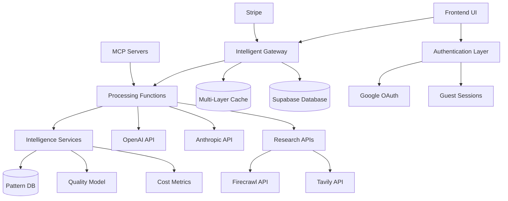
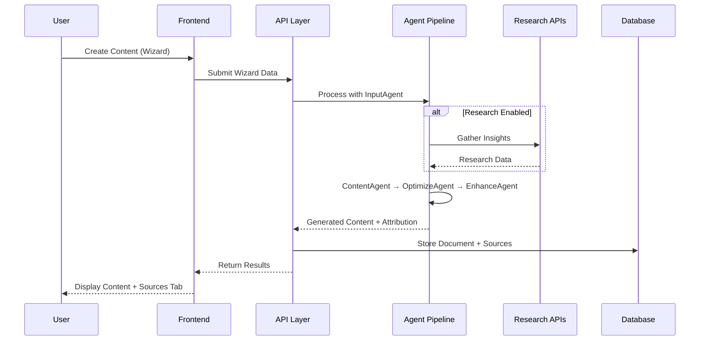
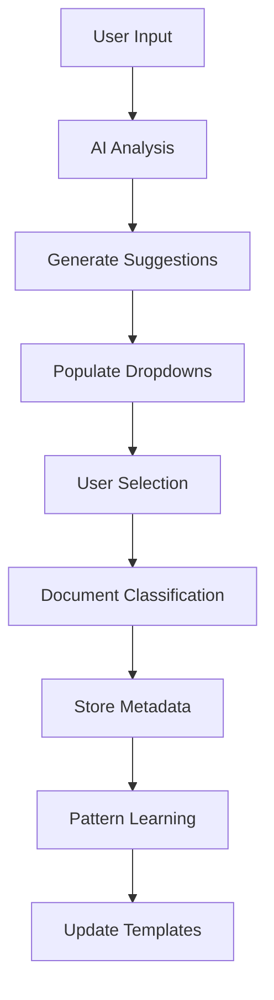
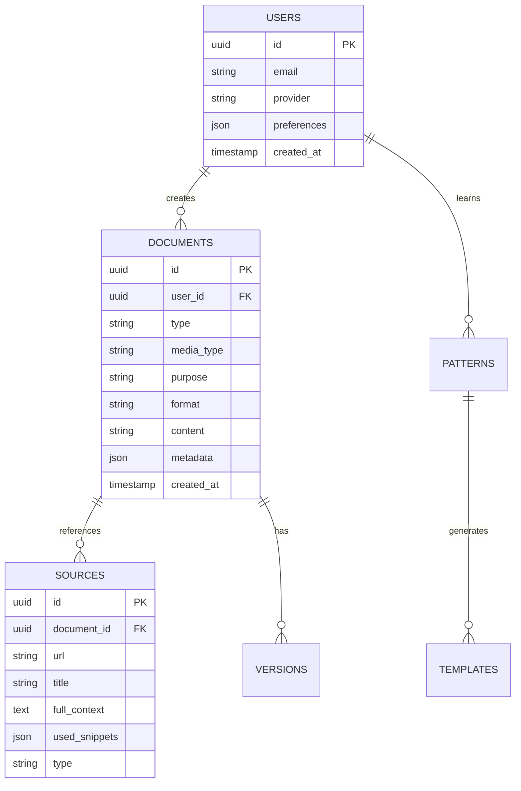
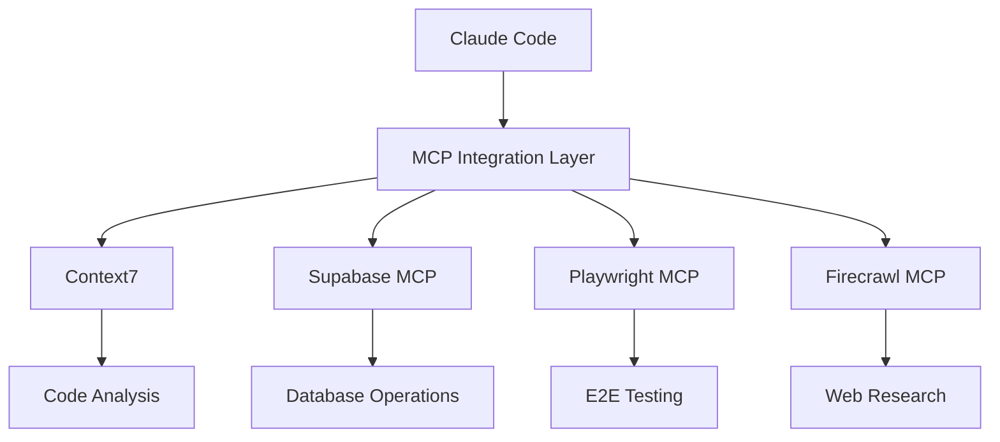
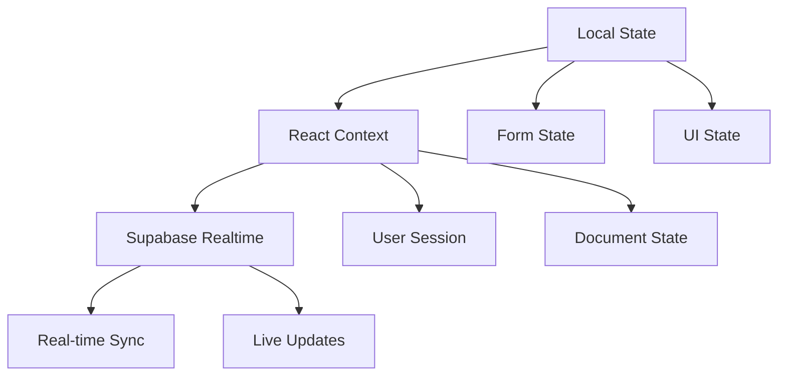
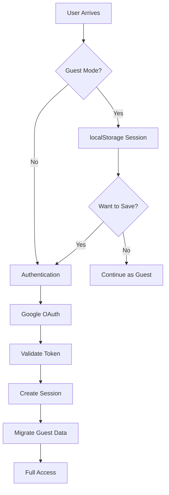

# StoryScale Architecture

## 🏗️ System Overview (Updated August 2025)

StoryScale is a modern AI-powered content studio built with a **3-layer function-based architecture** using Next.js 14, TypeScript, and Supabase. The system follows a Research → Plan → Implement workflow with intelligent document identification and multi-provider AI integration.

**⚠️ Architecture Updated**: Based on expert analysis, the original microservices agent approach has been replaced with a simplified 3-layer system for better performance (4-6s vs 15-30s) and maintainability (50% fewer integration points).



## 🎯 Core Architecture Principles

### 1. **Progressive Enhancement**
- **Guest Mode**: LocalStorage-based sessions (no auth required)
- **Authenticated Mode**: Full Supabase integration with sync
- **Seamless Migration**: Automatic data transfer on sign-up

### 2. **AI-First Design**
- **Multi-Provider Support**: OpenAI + Anthropic with fallbacks
- **Agent Pipeline**: Specialized agents for different tasks
- **Research Integration**: Optional enhancement with external APIs

### 3. **Document-Centric Architecture**
- **Type Classification**: linkedin, blog, marketing, image, text
- **Purpose Detection**: AI-powered classification with user override
- **Pattern Learning**: Template generation from successful content

## 🔄 Data Flow Architecture

### Content Generation Flow


### Document Identification Flow


## 🧠 New 3-Layer Processing Architecture

### Function-Based Processing Layers
```typescript
interface ProcessingArchitecture {
  // Layer 1: Intelligent Gateway
  gateway: {
    classification: 'Request complexity analysis',
    routing: 'Smart routing to appropriate functions',
    caching: '50% hit rate across 3 cache levels',
    costTracking: 'Real-time cost monitoring'
  }
  
  // Layer 2: Processing Functions (stateless, composable)
  processing: {
    research: '(request) => ResearchData',
    generate: '(context) => Content', 
    optimize: '(content) => EnhancedContent',
    validate: '(content) => QualityScore'
  }
  
  // Layer 3: Intelligence Services (shared)
  intelligence: {
    patternDB: 'Vector database for templates',
    qualityModel: 'ML-based content scoring',
    costMetrics: 'Performance and cost analytics'
  }
}
```

### New Processing Flow
```mermaid
graph LR
    GATEWAY[Intelligent Gateway] --> CACHE{Cache Hit?}
    CACHE -->|Yes| RESPONSE[Return <1s]
    CACHE -->|No| FUNCTIONS[Processing Functions]
    
    FUNCTIONS --> RESEARCH[research()]
    FUNCTIONS --> GENERATE[generate()]
    FUNCTIONS --> OPTIMIZE[optimize()]
    FUNCTIONS --> VALIDATE[validate()]
    
    RESEARCH -.-> INTEL[Intelligence Services]
    GENERATE -.-> INTEL
    OPTIMIZE -.-> INTEL
    VALIDATE -.-> INTEL
    
    INTEL --> PATTERNS[(Pattern DB)]
    INTEL --> QUALITY[Quality Model]
    INTEL --> METRICS[Cost Metrics]
```

### Provider Architecture
```typescript
// Multi-provider configuration with fallbacks
interface AIProviderSystem {
  primary: OpenAIProvider
  fallback: AnthropicProvider[]
  
  routing: {
    model: string
    provider: 'openai' | 'anthropic'
    fallbackChain: Provider[]
  }
  
  monitoring: {
    responseTime: number
    errorRate: number
    quota: QuotaStatus
  }
}
```

## 💾 Data Architecture

### Database Schema Overview


### Storage Strategy
```typescript
interface StorageArchitecture {
  // Guest sessions (30-day limit)
  guest: {
    provider: 'localStorage'
    encryption: false
    expiry: '30 days'
    migration: 'automatic on auth'
  }
  
  // Authenticated users
  authenticated: {
    provider: 'supabase'
    encryption: 'at rest'
    backup: 'automatic'
    sync: 'realtime'
  }
  
  // File storage
  assets: {
    provider: 'supabase storage'
    cdn: 'automatic'
    optimization: 'image processing'
  }
}
```

## 🔌 Integration Architecture

### External API Integration
```typescript
interface ExternalIntegrations {
  ai: {
    openai: {
      models: ['gpt-4-turbo', 'gpt-4', 'gpt-3.5-turbo']
      rateLimits: OpenAILimits
      fallback: 'anthropic'
    }
    anthropic: {
      models: ['claude-3-opus', 'claude-3-sonnet', 'claude-3-haiku']
      rateLimits: AnthropicLimits
      fallback: 'openai'
    }
  }
  
  research: {
    firecrawl: {
      use: 'LinkedIn analysis, competitor research'
      cache: '1 hour'
      fallback: 'tavily'
    }
    tavily: {
      use: 'General search, fact-checking'
      cache: '1 hour'
      fallback: 'skip research'
    }
  }
  
  payments: {
    stripe: {
      provider: 'CheckoutProvider'
      webhooks: true
      security: 'webhook signatures'
    }
  }
}
```

### MCP Server Architecture


## 📱 Frontend Architecture

### Component Hierarchy
```typescript
interface ComponentArchitecture {
  layout: {
    Workspace: 'Main container'
    Sidebar: 'Navigation & tools'
    ContentArea: 'Dynamic content'
  }
  
  features: {
    Wizard: 'Multi-step content creation'
    Editor: 'Content refinement'
    Dashboard: 'Analytics & management'
  }
  
  shared: {
    UI: 'Base components'
    Forms: 'Form components'
    Display: 'Data visualization'
  }
}
```

### State Management


## 🚀 Performance Architecture

### Optimization Strategies
```typescript
interface PerformanceStrategy {
  frontend: {
    bundleSplitting: 'Route-based + component lazy loading'
    imageOptimization: 'Next.js Image component'
    caching: 'SWR for API calls'
    prefetching: 'Next.js automatic prefetching'
  }
  
  backend: {
    apiCaching: 'Research results (1 hour)'
    dbOptimization: 'Indexed queries + RLS'
    rateLimiting: 'Per-user and per-endpoint'
    monitoring: 'Response time tracking'
  }
  
  ai: {
    providerSelection: 'Based on response time'
    caching: 'Template patterns'
    fallbacks: 'Automatic failover'
    timeout: '30 seconds max'
  }
}
```

### Scalability Considerations
```typescript
interface ScalabilityPlan {
  horizontal: {
    api: 'Vercel edge functions'
    database: 'Supabase connection pooling'
    cdn: 'Global edge caching'
  }
  
  vertical: {
    agents: 'Parallel processing where possible'
    research: 'Concurrent API calls'
    generation: 'Streaming responses'
  }
  
  monitoring: {
    performance: 'Real User Monitoring'
    errors: 'Error boundary reporting'
    usage: 'Analytics tracking'
  }
}
```

## 🔒 Security Architecture

### Authentication Flow


### Data Security
```typescript
interface SecurityArchitecture {
  authentication: {
    guest: 'localStorage only (client-side)'
    authenticated: 'Supabase Auth (server-side)'
    sessions: 'JWT with refresh tokens'
  }
  
  authorization: {
    rls: 'Row Level Security in Supabase'
    api: 'Route-level authentication'
    client: 'Role-based UI rendering'
  }
  
  data: {
    encryption: 'At rest in Supabase'
    transmission: 'HTTPS/TLS everywhere'
    privacy: 'GDPR compliant data handling'
  }
}
```

## 📊 Monitoring & Analytics

### System Monitoring
```typescript
interface MonitoringStrategy {
  performance: {
    frontend: 'Core Web Vitals'
    api: 'Response time & error rates'
    agents: 'Processing time per agent'
    research: 'External API performance'
  }
  
  business: {
    usage: 'Content generation metrics'
    success: 'Pattern learning effectiveness'
    engagement: 'Template usage rates'
    conversion: 'Free to paid transitions'
  }
  
  errors: {
    frontend: 'Error boundaries + reporting'
    api: 'Structured logging'
    agents: 'Failure tracking + fallbacks'
    external: 'Third-party service status'
  }
}
```

## 🔮 Future Architecture Considerations

### Planned Enhancements
- **Multi-tenancy**: Team workspaces and collaboration
- **Real-time Collaboration**: Multiple users editing simultaneously  
- **Advanced Analytics**: Engagement prediction and optimization
- **Custom Model Integration**: User-trained brand voice models
- **Cross-platform Publishing**: Direct social media integration

### Scalability Roadmap
- **Microservices Migration**: Break out agents into separate services
- **Event-driven Architecture**: Async processing for heavy operations
- **Global Distribution**: Multi-region deployment for performance
- **Advanced Caching**: Redis for session and template caching

---

*This architecture documentation is connected to:*
- *[claude.md](./claude.md) - Development guide and workflows*
- *[frontend.md](./frontend.md) - UI component architecture*  
- *[api.md](./api.md) - API endpoint specifications*
- *[database.md](./database.md) - Database schema details*
- *[agents.md](./agents.md) - AI agent implementation*