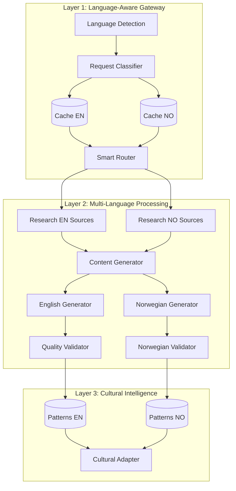

# StoryScale Architecture

## 🏗️ System Overview (Updated August 2025)

StoryScale is a modern AI-powered content studio built with a **3-layer function-based architecture** using Next.js 14, TypeScript, and Supabase. The system follows a Research → Plan → Implement workflow with intelligent document identification, multi-provider AI integration, and **multi-language support (English & Norwegian)**.

**⚠️ Architecture Updated**: Based on expert analysis, the original microservices agent approach has been replaced with a simplified 3-layer system for better performance (4-6s vs 15-30s) and maintainability (50% fewer integration points).


## 🎯 Core Architecture Principles

### 1. **Progressive Enhancement**
- **Guest Mode**: LocalStorage-based sessions (no auth required)
- **Authenticated Mode**: Full Supabase integration with sync
- **Seamless Migration**: Automatic data transfer on sign-up

### 2. **AI-First Design**
- **Multi-Provider Support**: OpenAI + Anthropic with fallbacks
- **Multi-Language Generation**: English & Norwegian content with cultural adaptation
- **Agent Pipeline**: Specialized agents for different tasks
- **Research Integration**: Optional enhancement with external APIs

### 3. **Document-Centric Architecture**
- **Type Classification**: linkedin, blog, marketing, image, text
- **Purpose Detection**: AI-powered classification with user override
- **Pattern Learning**: Template generation from successful content

## 🔄 Data Flow Architecture

### Content Generation Flow

```mermaid
sequenceDiagram
    participant U as User
    participant UI as Frontend
    participant API as API Layer
    participant AI as Agent Pipeline
    participant R as Research APIs
    participant DB as Database

    U->>UI: Create Content (Wizard)
    UI->>API: Submit Wizard Data
    API->>AI: Process with InputAgent
    
    alt Research Enabled
        AI->>R: Gather Insights
        R-->>AI: Research Data
    end
    
    AI->>AI: ContentAgent → OptimizeAgent → EnhanceAgent
    AI-->>API: Generated Content + Attribution
    API->>DB: Store Document + Sources
    API-->>UI: Return Results
    UI-->>U: Display Content + Sources Tab
```


### Document Identification Flow


## 🧠 New 3-Layer Processing Architecture

### Function-Based Processing Layers
```typescript
interface ProcessingArchitecture {
  // Layer 1: Intelligent Gateway
  gateway: {
    classification: 'Request complexity analysis',
    routing: 'Smart routing to appropriate functions',
    caching: '50% hit rate across 3 cache levels',
    costTracking: 'Real-time cost monitoring'
  }
  
  // Layer 2: Processing Functions (stateless, composable)
  processing: {
    research: '(request) => ResearchData',
    generate: '(context) => Content', 
    optimize: '(content) => EnhancedContent',
    validate: '(content) => QualityScore'
  }
  
  // Layer 3: Intelligence Services (shared)
  intelligence: {
    patternDB: 'Vector database for templates',
    qualityModel: 'ML-based content scoring',
    costMetrics: 'Performance and cost analytics'
  }
}
```

### New Processing Flow
```mermaid
graph LR
    GATEWAY[Intelligent Gateway] --> CACHE{Cache Hit?}
    CACHE -->|Yes| RESPONSE[Return <1s]
    CACHE -->|No| FUNCTIONS[Processing Functions]
    
    FUNCTIONS --> RESEARCH[research()]
    FUNCTIONS --> GENERATE[generate()]
    FUNCTIONS --> OPTIMIZE[optimize()]
    FUNCTIONS --> VALIDATE[validate()]
    
    RESEARCH -.-> INTEL[Intelligence Services]
    GENERATE -.-> INTEL
    OPTIMIZE -.-> INTEL
    VALIDATE -.-> INTEL
    
    INTEL --> PATTERNS[(Pattern DB)]
    INTEL --> QUALITY[Quality Model]
    INTEL --> METRICS[Cost Metrics]
```

## 🌍 Multi-Language Architecture (Norwegian Support)

### Language-Aware System Design



### Multi-Language Data Flow

```typescript
interface LanguageAwareRequest {
  // Core content request
  content: string
  purpose: 'thought-leadership' | 'question' | 'value' | 'authority'
  format: 'story' | 'insight' | 'list' | 'howto' | 'question'
  
  // Language specification
  outputLanguage: 'en' | 'no'
  contentLanguage?: 'auto' | 'en' | 'no'  // Input detection
  
  // Cultural adaptation
  culturalContext?: {
    formality: 'formal' | 'semi-formal' | 'informal'
    businessNorms: string[]  // ['jantelov-aware', 'consensus-focused']
    dialect?: 'bokmål' | 'nynorsk'  // Norwegian variants
  }
}

interface LanguageAwareResponse {
  content: {
    text: string
    language: 'en' | 'no'
    confidence: number
    culturalAdaptations: string[]
  }
  sources?: LanguageAwareSource[]
  quality: {
    grammarScore: number
    culturalScore: number  // Norwegian business appropriateness
    overallScore: number
  }
  metadata: {
    processingTime: number
    languageDetected?: 'en' | 'no'
    translationUsed: boolean
  }
}
```

### Norwegian Language Pipeline

```typescript
// Norwegian Content Generation Pipeline
class NorwegianContentPipeline {
  async process(request: LanguageAwareRequest): Promise<LanguageAwareResponse> {
    // 1. Norwegian Research Sources
    const norwegianSources = await this.researchFunction.gather({
      ...request,
      sources: ['dn.no', 'vg.no', 'nrk.no', 'e24.no', 'linkedin.com/in/*/no']
    })
    
    // 2. Norwegian Content Generation
    const content = await this.generateFunction.create({
      ...request,
      prompt: this.norwegianPrompts.buildPrompt(request),
      culturalGuidelines: this.norwegianCulture.getGuidelines(request.culturalContext)
    })
    
    // 3. Norwegian Quality Validation
    const validation = await this.norwegianValidator.validate(content, {
      grammarCheck: true,
      culturalCheck: true,
      businessAppropriate: true,
      jantelovCompliant: true
    })
    
    // 4. Norwegian Pattern Learning
    if (validation.score > 0.7) {
      await this.norwegianPatterns.learn(request, content, validation)
    }
    
    return {
      content: {
        text: content,
        language: 'no',
        confidence: validation.score,
        culturalAdaptations: validation.culturalAdaptations
      },
      sources: norwegianSources,
      quality: validation,
      metadata: {
        processingTime: Date.now() - startTime,
        languageDetected: request.contentLanguage,
        translationUsed: false
      }
    }
  }
}
```

### Language-Specific Components

#### 1. Norwegian Research Sources
```typescript
const norwegianResearchSources = {
  business: ['dn.no', 'e24.no', 'kapital.no'],
  news: ['nrk.no', 'vg.no', 'aftenposten.no'],
  professional: ['linkedin.com/pulse/no/', 'digi.no', 'tu.no'],
  government: ['regjeringen.no', 'ssb.no', 'nav.no']
}
```

#### 2. Norwegian AI Model Configuration
```typescript
const norwegianModelConfig = {
  openai: {
    model: 'gpt-4-turbo',
    systemPrompt: `Du er en norsk profesjonell innholdsskaper. Skriv naturlig, engasjerende norsk innhold som passer for LinkedIn og profesjonell kommunikasjon. Følg norske forretningsmoral og kommunikasjonsstil.`,
    temperature: 0.7,
    culturalInstructions: [
      'Vær bevisst på janteloven - unngå overdreven selvskryt',
      'Fokuser på samarbeid og konsensus',
      'Bruk inkluderende språk',
      'Respekter work-life balance verdier'
    ]
  },
  anthropic: {
    model: 'claude-3-sonnet',
    systemPrompt: `Du skriver profesjonelt norsk innhold for LinkedIn...`,
    fallbackForOpenAI: true
  }
}
```

#### 3. Norwegian Quality Metrics
```typescript
interface NorwegianQualityMetrics {
  grammarScore: number        // 0-1: Norwegian grammar correctness
  culturalScore: number       // 0-1: Business culture appropriateness
  jantelovScore: number       // 0-1: Jantelov compliance (modesty)
  consensusScore: number      // 0-1: Collaboration-oriented language
  formalityScore: number      // 0-1: Appropriate formality level
  readabilityScore: number    // 0-1: Norwegian readability
  overallScore: number        // Weighted average
}
```

### Cache Strategy for Multi-Language

```typescript
interface LanguageAwareCache {
  // Cache keys include language parameter
  generateKey(request: LanguageAwareRequest): string {
    return `${request.content.hash}:${request.outputLanguage}:${request.culturalContext?.formality}`
  }
  
  // Cross-language cache sharing for common patterns
  sharedPatterns: {
    'business-update': ['en', 'no'],  // Can share structure
    'thought-leadership': ['en', 'no'],
    'question-post': ['en', 'no']
  }
  
  // Language-specific cache warming
  warmCacheForLanguage(language: 'en' | 'no'): Promise<void>
}
```

### Performance Targets with Norwegian Support

```yaml
performance_targets:
  english_content:
    simple_requests: "<1s (cached)"
    complex_requests: "4-6s"
    cache_hit_rate: "50%"
  
  norwegian_content:
    simple_requests: "<1.2s (cached + language processing)"
    complex_requests: "5-7s (includes cultural validation)"
    cache_hit_rate: "40%" # Lower due to language fragmentation
    translation_accuracy: ">95%"
    cultural_appropriateness: ">90%"

quality_targets:
  norwegian_content:
    grammar_accuracy: ">95%"
    cultural_appropriateness: ">90%"
    business_tone_match: ">85%"
    user_satisfaction: ">80%"
```

### Provider Architecture
```typescript
// Multi-provider configuration with fallbacks
interface AIProviderSystem {
  primary: OpenAIProvider
  fallback: AnthropicProvider[]
  
  routing: {
    model: string
    provider: 'openai' | 'anthropic'
    fallbackChain: Provider[]
  }
  
  monitoring: {
    responseTime: number
    errorRate: number
    quota: QuotaStatus
  }
}
```

## 💾 Data Architecture

### Database Schema Overview


### Storage Strategy
```typescript
interface StorageArchitecture {
  // Guest sessions (30-day limit)
  guest: {
    provider: 'localStorage'
    encryption: false
    expiry: '30 days'
    migration: 'automatic on auth'
  }
  
  // Authenticated users
  authenticated: {
    provider: 'supabase'
    encryption: 'at rest'
    backup: 'automatic'
    sync: 'realtime'
  }
  
  // File storage
  assets: {
    provider: 'supabase storage'
    cdn: 'automatic'
    optimization: 'image processing'
  }
}
```

## 🔌 Integration Architecture

### External API Integration
```typescript
interface ExternalIntegrations {
  ai: {
    openai: {
      models: ['gpt-4-turbo', 'gpt-4', 'gpt-3.5-turbo']
      rateLimits: OpenAILimits
      fallback: 'anthropic'
    }
    anthropic: {
      models: ['claude-3-opus', 'claude-3-sonnet', 'claude-3-haiku']
      rateLimits: AnthropicLimits
      fallback: 'openai'
    }
  }
  
  research: {
    firecrawl: {
      use: 'LinkedIn analysis, competitor research'
      cache: '1 hour'
      fallback: 'tavily'
    }
    tavily: {
      use: 'General search, fact-checking'
      cache: '1 hour'
      fallback: 'skip research'
    }
  }
  
  payments: {
    stripe: {
      provider: 'CheckoutProvider'
      webhooks: true
      security: 'webhook signatures'
    }
  }
}
```

### MCP Server Architecture


## 📱 Frontend Architecture

### Component Hierarchy
```typescript
interface ComponentArchitecture {
  layout: {
    Workspace: 'Main container'
    Sidebar: 'Navigation & tools'
    ContentArea: 'Dynamic content'
  }
  
  features: {
    Wizard: 'Multi-step content creation'
    Editor: 'Content refinement'
    Dashboard: 'Analytics & management'
  }
  
  shared: {
    UI: 'Base components'
    Forms: 'Form components'
    Display: 'Data visualization'
  }
}
```

### State Management


## 🚀 Performance Architecture

### Optimization Strategies
```typescript
interface PerformanceStrategy {
  frontend: {
    bundleSplitting: 'Route-based + component lazy loading'
    imageOptimization: 'Next.js Image component'
    caching: 'SWR for API calls'
    prefetching: 'Next.js automatic prefetching'
  }
  
  backend: {
    apiCaching: 'Research results (1 hour)'
    dbOptimization: 'Indexed queries + RLS'
    rateLimiting: 'Per-user and per-endpoint'
    monitoring: 'Response time tracking'
  }
  
  ai: {
    providerSelection: 'Based on response time'
    caching: 'Template patterns'
    fallbacks: 'Automatic failover'
    timeout: '30 seconds max'
  }
}
```

### Scalability Considerations
```typescript
interface ScalabilityPlan {
  horizontal: {
    api: 'Vercel edge functions'
    database: 'Supabase connection pooling'
    cdn: 'Global edge caching'
  }
  
  vertical: {
    agents: 'Parallel processing where possible'
    research: 'Concurrent API calls'
    generation: 'Streaming responses'
  }
  
  monitoring: {
    performance: 'Real User Monitoring'
    errors: 'Error boundary reporting'
    usage: 'Analytics tracking'
  }
}
```

## 🔒 Security Architecture

### Authentication Flow


### Data Security
```typescript
interface SecurityArchitecture {
  authentication: {
    guest: 'localStorage only (client-side)'
    authenticated: 'Supabase Auth (server-side)'
    sessions: 'JWT with refresh tokens'
  }
  
  authorization: {
    rls: 'Row Level Security in Supabase'
    api: 'Route-level authentication'
    client: 'Role-based UI rendering'
  }
  
  data: {
    encryption: 'At rest in Supabase'
    transmission: 'HTTPS/TLS everywhere'
    privacy: 'GDPR compliant data handling'
  }
}
```

## 📊 Monitoring & Analytics

### System Monitoring
```typescript
interface MonitoringStrategy {
  performance: {
    frontend: 'Core Web Vitals'
    api: 'Response time & error rates'
    agents: 'Processing time per agent'
    research: 'External API performance'
  }
  
  business: {
    usage: 'Content generation metrics'
    success: 'Pattern learning effectiveness'
    engagement: 'Template usage rates'
    conversion: 'Free to paid transitions'
  }
  
  errors: {
    frontend: 'Error boundaries + reporting'
    api: 'Structured logging'
    agents: 'Failure tracking + fallbacks'
    external: 'Third-party service status'
  }
}
```

## 🔮 Future Architecture Considerations

### Planned Enhancements
- **Multi-tenancy**: Team workspaces and collaboration
- **Real-time Collaboration**: Multiple users editing simultaneously  
- **Advanced Analytics**: Engagement prediction and optimization
- **Custom Model Integration**: User-trained brand voice models
- **Cross-platform Publishing**: Direct social media integration

### Scalability Roadmap
- **Microservices Migration**: Break out agents into separate services
- **Event-driven Architecture**: Async processing for heavy operations
- **Global Distribution**: Multi-region deployment for performance
- **Advanced Caching**: Redis for session and template caching

---

*This architecture documentation is connected to:*
- *[claude.md](./claude.md) - Development guide and workflows*
- *[frontend.md](./frontend.md) - UI component architecture*  
- *[api.md](./api.md) - API endpoint specifications*
- *[database.md](./database.md) - Database schema details*
- *[agents.md](./agents.md) - AI agent implementation*