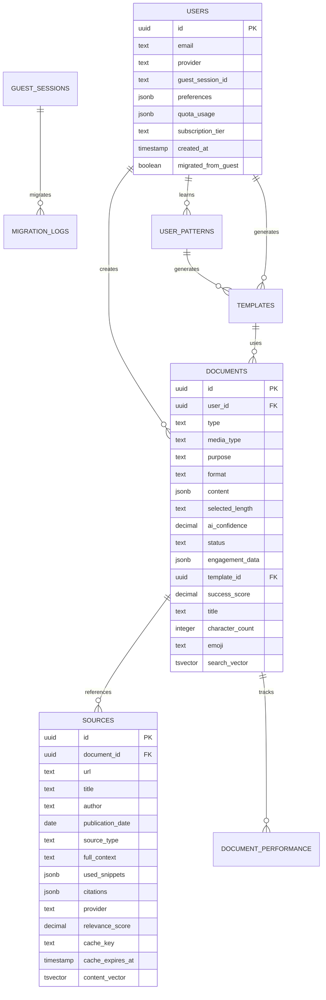

# StoryScale Database Design

## 🗄️ Database Overview

StoryScale uses **Supabase** (PostgreSQL) as the primary database with a focus on document identification, pattern learning, and progressive user enhancement. The schema supports both guest and authenticated users with seamless data migration.

**Key Design Principles:**
- **Progressive Enhancement**: Guest → Authenticated user flow
- **Document-Centric**: All data revolves around content documents
- **AI-Optimized**: Schema designed for pattern learning and template generation
- **Research Attribution**: Complete source tracking and citation management
- **Performance-First**: Optimized indexes and caching strategies

## 📊 Database Schema

### Core Entity Relationship


## 🏗️ Table Specifications

### Users Table
```sql
CREATE TABLE users (
    id UUID PRIMARY KEY DEFAULT gen_random_uuid(),
    email TEXT UNIQUE,
    provider TEXT DEFAULT 'guest', -- 'guest', 'google', 'email'
    guest_session_id TEXT UNIQUE, -- For guest users
    preferences JSONB DEFAULT '{}',
    quota_usage JSONB DEFAULT '{"documents": 0, "research_calls": 0}',
    subscription_tier TEXT DEFAULT 'free',
    created_at TIMESTAMP WITH TIME ZONE DEFAULT NOW(),
    last_active TIMESTAMP WITH TIME ZONE DEFAULT NOW(),
    migrated_from_guest BOOLEAN DEFAULT FALSE,
    
    -- Constraints
    CONSTRAINT valid_provider CHECK (provider IN ('guest', 'google', 'email')),
    CONSTRAINT valid_tier CHECK (subscription_tier IN ('free', 'pro', 'enterprise'))
);
```

**Key Features:**
- **Progressive Enhancement**: Supports guest sessions with seamless upgrade path
- **Quota Management**: Built-in usage tracking per user
- **Flexible Authentication**: Multiple auth providers supported

### Documents Table
```sql
CREATE TABLE documents (
    id UUID PRIMARY KEY DEFAULT gen_random_uuid(),
    user_id UUID REFERENCES users(id) ON DELETE CASCADE,
    
    -- Document identification (AI-powered classification)
    type TEXT NOT NULL, -- 'linkedin', 'blog', 'marketing', 'image', 'text'
    media_type TEXT NOT NULL, -- 'text-only', 'image', 'video', 'carousel'
    purpose TEXT NOT NULL, -- 'thought-leadership', 'question', 'value', 'authority'
    format TEXT NOT NULL, -- 'story', 'insight', 'list', 'howto', 'question'
    
    -- Content storage with length variants
    content JSONB NOT NULL DEFAULT '{}', -- {short, medium, long, selected}
    selected_length TEXT DEFAULT 'medium',
    
    -- AI metadata
    ai_confidence DECIMAL(3,2),
    generation_model TEXT,
    processing_time_ms INTEGER,
    
    -- User interaction
    status TEXT DEFAULT 'draft', -- 'draft', 'published', 'archived'
    engagement_data JSONB DEFAULT '{}', -- Platform-specific engagement
    
    -- Pattern learning
    template_id UUID REFERENCES templates(id),
    success_score DECIMAL(3,2), -- Based on engagement
    
    -- Generated metadata
    title TEXT GENERATED ALWAYS AS (
        COALESCE(
            content->>'title',
            LEFT(content->>'selected', 50) || '...'
        )
    ) STORED,
    character_count INTEGER GENERATED ALWAYS AS (
        LENGTH(content->>'selected')
    ) STORED,
    emoji TEXT, -- AI-suggested emoji
    
    created_at TIMESTAMP WITH TIME ZONE DEFAULT NOW(),
    updated_at TIMESTAMP WITH TIME ZONE DEFAULT NOW(),
    published_at TIMESTAMP WITH TIME ZONE,
    
    -- Full-text search optimization
    search_vector TSVECTOR GENERATED ALWAYS AS (
        to_tsvector('english', 
            COALESCE(content->>'selected', '') || ' ' ||
            COALESCE(title, '') || ' ' ||
            type || ' ' || purpose || ' ' || format
        )
    ) STORED,
    
    -- Constraints for document identification
    CONSTRAINT valid_type CHECK (type IN ('linkedin', 'blog', 'marketing', 'image', 'text')),
    CONSTRAINT valid_media_type CHECK (media_type IN ('text-only', 'image', 'video', 'carousel')),
    CONSTRAINT valid_purpose CHECK (purpose IN ('thought-leadership', 'question', 'value', 'authority')),
    CONSTRAINT valid_format CHECK (format IN ('story', 'insight', 'list', 'howto', 'question')),
    CONSTRAINT valid_status CHECK (status IN ('draft', 'published', 'archived')),
    CONSTRAINT valid_length CHECK (selected_length IN ('short', 'medium', 'long'))
);
```

**Key Features:**
- **Document Classification**: AI-powered type, purpose, and format detection
- **Length Variants**: Multiple content lengths generated simultaneously
- **Full-Text Search**: Optimized search across all document content
- **Generated Columns**: Automatic title and character count computation

### Research Sources Table
```sql
CREATE TABLE sources (
    id UUID PRIMARY KEY DEFAULT gen_random_uuid(),
    document_id UUID REFERENCES documents(id) ON DELETE CASCADE,
    
    -- Source identification
    url TEXT NOT NULL,
    title TEXT NOT NULL,
    author TEXT,
    publication_date DATE,
    source_type TEXT NOT NULL, -- 'article', 'blog', 'social', 'academic', 'news'
    
    -- Content storage for complete attribution
    full_context TEXT NOT NULL, -- Complete extracted content
    used_snippets JSONB NOT NULL DEFAULT '[]', -- Array of used text snippets
    citations JSONB DEFAULT '[]', -- Where in document this source was cited
    
    -- Research metadata
    provider TEXT NOT NULL, -- 'firecrawl', 'tavily', 'manual'
    relevance_score DECIMAL(3,2),
    extraction_time TIMESTAMP WITH TIME ZONE DEFAULT NOW(),
    
    -- Caching optimization
    cache_key TEXT UNIQUE, -- For deduplication
    cache_expires_at TIMESTAMP WITH TIME ZONE,
    
    created_at TIMESTAMP WITH TIME ZONE DEFAULT NOW(),
    
    -- Content search optimization
    content_vector TSVECTOR GENERATED ALWAYS AS (
        to_tsvector('english', full_context || ' ' || title)
    ) STORED,
    
    -- Constraints
    CONSTRAINT valid_source_type CHECK (source_type IN ('article', 'blog', 'social', 'academic', 'news')),
    CONSTRAINT valid_provider CHECK (provider IN ('firecrawl', 'tavily', 'manual'))
);
```

**Key Features:**
- **Complete Attribution**: Full context storage with snippet tracking
- **Smart Caching**: Deduplication and expiration management
- **Provider Tracking**: Integration with research APIs
- **Citation Mapping**: Precise tracking of source usage in content

## 🧠 Pattern Learning Schema

### User Patterns Table
```sql
CREATE TABLE user_patterns (
    id UUID PRIMARY KEY DEFAULT gen_random_uuid(),
    user_id UUID REFERENCES users(id) ON DELETE CASCADE,
    
    -- Pattern identification
    pattern_type TEXT NOT NULL, -- 'successful_post', 'template', 'style_preference'
    
    -- Pattern data storage
    pattern_data JSONB NOT NULL,
    /*
    Example successful_post pattern:
    {
        "type": "successful_post",
        "purpose": "thought-leadership",
        "format": "story",
        "tone": "professional",
        "engagement": 847,
        "character_range": [1100, 1300],
        "structure": ["hook", "story", "lesson", "cta"],
        "optimal_posting_time": "09:00",
        "hashtag_count": 3,
        "emoji_usage": true
    }
    */
    
    -- Learning metadata
    confidence_score DECIMAL(3,2),
    sample_size INTEGER DEFAULT 1,
    last_reinforced TIMESTAMP WITH TIME ZONE DEFAULT NOW(),
    
    created_at TIMESTAMP WITH TIME ZONE DEFAULT NOW(),
    updated_at TIMESTAMP WITH TIME ZONE DEFAULT NOW(),
    
    CONSTRAINT valid_pattern_type CHECK (pattern_type IN ('successful_post', 'template', 'style_preference'))
);
```

### Templates Table
```sql
CREATE TABLE templates (
    id UUID PRIMARY KEY DEFAULT gen_random_uuid(),
    user_id UUID REFERENCES users(id) ON DELETE CASCADE,
    pattern_id UUID REFERENCES user_patterns(id),
    
    -- Template identification
    name TEXT NOT NULL,
    description TEXT,
    
    -- Template structure
    structure JSONB NOT NULL,
    /*
    Template structure example:
    {
        "sections": ["hook", "story", "lesson", "cta"],
        "prompts": {
            "hook": "Start with a compelling question or statement",
            "story": "Share a personal or professional experience",
            "lesson": "Extract the key insight or learning",
            "cta": "End with an engaging call-to-action"
        },
        "style_guide": {
            "tone": "professional",
            "voice": "authentic",
            "perspective": "first-person"
        }
    }
    */
    
    -- Performance metrics
    use_count INTEGER DEFAULT 0,
    avg_engagement DECIMAL(5,2),
    success_rate DECIMAL(3,2),
    
    -- Template metadata
    is_active BOOLEAN DEFAULT TRUE,
    is_ai_generated BOOLEAN DEFAULT TRUE,
    tags TEXT[] DEFAULT '{}',
    
    created_at TIMESTAMP WITH TIME ZONE DEFAULT NOW(),
    updated_at TIMESTAMP WITH TIME ZONE DEFAULT NOW()
);
```

## 📈 Performance & Analytics

### Document Performance Tracking
```sql
CREATE TABLE document_performance (
    id UUID PRIMARY KEY DEFAULT gen_random_uuid(),
    document_id UUID REFERENCES documents(id) ON DELETE CASCADE,
    
    -- Platform-specific metrics
    platform TEXT NOT NULL, -- 'linkedin', 'twitter', 'blog'
    engagement_metrics JSONB NOT NULL,
    /*
    Engagement metrics structure:
    {
        "likes": 45,
        "comments": 12,
        "shares": 8,
        "views": 1247,
        "clicks": 23,
        "total_engagement": 88,
        "engagement_rate": 0.071
    }
    */
    
    -- Timing data
    posted_at TIMESTAMP WITH TIME ZONE,
    measured_at TIMESTAMP WITH TIME ZONE DEFAULT NOW(),
    
    -- Computed performance score
    performance_score DECIMAL(3,2) GENERATED ALWAYS AS (
        LEAST(((engagement_metrics->>'total_engagement')::INTEGER / 100.0), 1.0)
    ) STORED,
    
    created_at TIMESTAMP WITH TIME ZONE DEFAULT NOW()
);
```

## 👤 Session Management

### Guest Sessions
```sql
CREATE TABLE guest_sessions (
    id UUID PRIMARY KEY DEFAULT gen_random_uuid(),
    session_id TEXT UNIQUE NOT NULL,
    
    -- Session data
    session_data JSONB DEFAULT '{}',
    document_count INTEGER DEFAULT 0,
    research_count INTEGER DEFAULT 0,
    
    -- Expiration management
    expires_at TIMESTAMP WITH TIME ZONE DEFAULT (NOW() + INTERVAL '30 days'),
    
    -- Migration tracking
    migrated_to_user_id UUID REFERENCES users(id),
    migrated_at TIMESTAMP WITH TIME ZONE,
    
    created_at TIMESTAMP WITH TIME ZONE DEFAULT NOW(),
    last_accessed TIMESTAMP WITH TIME ZONE DEFAULT NOW()
);

CREATE TABLE migration_logs (
    id UUID PRIMARY KEY DEFAULT gen_random_uuid(),
    guest_session_id TEXT NOT NULL,
    user_id UUID REFERENCES users(id) NOT NULL,
    
    -- Migration details
    documents_migrated INTEGER DEFAULT 0,
    patterns_migrated INTEGER DEFAULT 0,
    migration_status TEXT DEFAULT 'pending',
    error_details TEXT,
    
    created_at TIMESTAMP WITH TIME ZONE DEFAULT NOW(),
    completed_at TIMESTAMP WITH TIME ZONE,
    
    CONSTRAINT valid_migration_status CHECK (migration_status IN ('pending', 'completed', 'failed'))
);
```

## ⚡ Performance Optimization

### Indexing Strategy
```sql
-- Document search and filtering indexes
CREATE INDEX idx_documents_user_type ON documents(user_id, type);
CREATE INDEX idx_documents_user_status ON documents(user_id, status);
CREATE INDEX idx_documents_user_created ON documents(user_id, created_at DESC);
CREATE INDEX idx_documents_search_vector ON documents USING GIN(search_vector);
CREATE INDEX idx_documents_purpose_format ON documents(purpose, format);

-- Source optimization indexes
CREATE INDEX idx_sources_document ON sources(document_id);
CREATE INDEX idx_sources_cache_key ON sources(cache_key) WHERE cache_key IS NOT NULL;
CREATE INDEX idx_sources_cache_expires ON sources(cache_expires_at) WHERE cache_expires_at IS NOT NULL;
CREATE INDEX idx_sources_content_vector ON sources USING GIN(content_vector);
CREATE INDEX idx_sources_url_hash ON sources(md5(url)); -- Deduplication

-- Pattern learning indexes
CREATE INDEX idx_user_patterns_user ON user_patterns(user_id, pattern_type);
CREATE INDEX idx_user_patterns_updated ON user_patterns(user_id, updated_at DESC);
CREATE INDEX idx_templates_user_active ON templates(user_id, is_active) WHERE is_active = TRUE;
CREATE INDEX idx_document_performance_document ON document_performance(document_id);

-- Session management indexes
CREATE INDEX idx_guest_sessions_expires ON guest_sessions(expires_at);
CREATE INDEX idx_guest_sessions_session_id ON guest_sessions(session_id);
CREATE INDEX idx_users_guest_session ON users(guest_session_id) WHERE guest_session_id IS NOT NULL;
```

### Caching Tables
```sql
-- Research API cache for expensive operations
CREATE TABLE research_cache (
    id UUID PRIMARY KEY DEFAULT gen_random_uuid(),
    cache_key TEXT UNIQUE NOT NULL,
    
    -- Cache identification
    topic_hash TEXT NOT NULL, -- MD5 hash of research topic
    provider TEXT NOT NULL,
    results JSONB NOT NULL,
    
    -- Cache metadata
    hit_count INTEGER DEFAULT 0,
    last_accessed TIMESTAMP WITH TIME ZONE DEFAULT NOW(),
    expires_at TIMESTAMP WITH TIME ZONE DEFAULT (NOW() + INTERVAL '1 hour'),
    
    created_at TIMESTAMP WITH TIME ZONE DEFAULT NOW()
);

-- Template cache for pattern matching
CREATE TABLE template_cache (
    id UUID PRIMARY KEY DEFAULT gen_random_uuid(),
    user_id UUID REFERENCES users(id) ON DELETE CASCADE,
    
    -- Cache identification
    pattern_signature TEXT NOT NULL, -- Hash of pattern characteristics
    
    -- Cached data
    template_data JSONB NOT NULL,
    usage_count INTEGER DEFAULT 0,
    last_used TIMESTAMP WITH TIME ZONE DEFAULT NOW(),
    
    created_at TIMESTAMP WITH TIME ZONE DEFAULT NOW(),
    
    UNIQUE(user_id, pattern_signature)
);
```

## 🔒 Row Level Security (RLS)

### Security Policies
```sql
-- Enable RLS on all user-specific tables
ALTER TABLE users ENABLE ROW LEVEL SECURITY;
ALTER TABLE documents ENABLE ROW LEVEL SECURITY;
ALTER TABLE sources ENABLE ROW LEVEL SECURITY;
ALTER TABLE user_patterns ENABLE ROW LEVEL SECURITY;
ALTER TABLE templates ENABLE ROW LEVEL SECURITY;

-- User record access
CREATE POLICY "Users can view own record" ON users
    FOR SELECT USING (auth.uid() = id OR (provider = 'guest' AND auth.uid() IS NULL));

CREATE POLICY "Users can update own record" ON users
    FOR UPDATE USING (auth.uid() = id);

-- Document access with guest support
CREATE POLICY "Users can view own documents" ON documents
    FOR SELECT USING (
        user_id = auth.uid() OR 
        (EXISTS (
            SELECT 1 FROM users 
            WHERE id = documents.user_id 
            AND provider = 'guest' 
            AND auth.uid() IS NULL
        ))
    );

-- Source access through document ownership
CREATE POLICY "Users can view sources of own documents" ON sources
    FOR SELECT USING (
        EXISTS (
            SELECT 1 FROM documents d 
            WHERE d.id = sources.document_id 
            AND (d.user_id = auth.uid() OR 
                 EXISTS (
                     SELECT 1 FROM users u 
                     WHERE u.id = d.user_id 
                     AND u.provider = 'guest' 
                     AND auth.uid() IS NULL
                 ))
        )
    );

-- Pattern and template policies
CREATE POLICY "Users can manage own patterns" ON user_patterns
    FOR ALL USING (user_id = auth.uid());

CREATE POLICY "Users can manage own templates" ON templates
    FOR ALL USING (user_id = auth.uid());
```

## 🔄 Migration Functions

### Guest to Authenticated Migration
```sql
CREATE OR REPLACE FUNCTION migrate_guest_to_authenticated(
    p_guest_session_id TEXT,
    p_user_id UUID
) RETURNS JSONB AS $$
DECLARE
    migration_result JSONB;
    documents_count INTEGER;
    patterns_count INTEGER;
BEGIN
    -- Start migration transaction
    BEGIN
        -- Create migration log
        INSERT INTO migration_logs (guest_session_id, user_id, migration_status)
        VALUES (p_guest_session_id, p_user_id, 'pending');
        
        -- Update guest user to authenticated
        UPDATE users 
        SET provider = 'google',
            migrated_from_guest = TRUE,
            guest_session_id = NULL
        WHERE guest_session_id = p_guest_session_id;
        
        -- Migrate documents
        SELECT COUNT(*) INTO documents_count
        FROM documents d
        JOIN users u ON d.user_id = u.id
        WHERE u.guest_session_id = p_guest_session_id;
        
        UPDATE documents 
        SET user_id = p_user_id
        WHERE user_id IN (
            SELECT id FROM users 
            WHERE guest_session_id = p_guest_session_id
        );
        
        -- Migrate patterns and templates
        SELECT COUNT(*) INTO patterns_count
        FROM user_patterns up
        JOIN users u ON up.user_id = u.id
        WHERE u.guest_session_id = p_guest_session_id;
        
        UPDATE user_patterns 
        SET user_id = p_user_id
        WHERE user_id IN (
            SELECT id FROM users 
            WHERE guest_session_id = p_guest_session_id
        );
        
        UPDATE templates 
        SET user_id = p_user_id
        WHERE user_id IN (
            SELECT id FROM users 
            WHERE guest_session_id = p_guest_session_id
        );
        
        -- Mark guest session as migrated
        UPDATE guest_sessions 
        SET migrated_to_user_id = p_user_id,
            migrated_at = NOW()
        WHERE session_id = p_guest_session_id;
        
        -- Complete migration log
        UPDATE migration_logs 
        SET migration_status = 'completed',
            documents_migrated = documents_count,
            patterns_migrated = patterns_count,
            completed_at = NOW()
        WHERE guest_session_id = p_guest_session_id 
        AND user_id = p_user_id;
        
        migration_result := jsonb_build_object(
            'success', true,
            'documents_migrated', documents_count,
            'patterns_migrated', patterns_count
        );
        
    EXCEPTION WHEN OTHERS THEN
        -- Log error
        UPDATE migration_logs 
        SET migration_status = 'failed',
            error_details = SQLERRM
        WHERE guest_session_id = p_guest_session_id 
        AND user_id = p_user_id;
        
        migration_result := jsonb_build_object(
            'success', false,
            'error', SQLERRM
        );
    END;
    
    RETURN migration_result;
END;
$$ LANGUAGE plpgsql;
```

## 🧹 Maintenance Functions

### Cache Cleanup
```sql
CREATE OR REPLACE FUNCTION cleanup_expired_cache()
RETURNS void AS $$
BEGIN
    -- Clean expired research cache
    DELETE FROM research_cache WHERE expires_at < NOW();
    
    -- Clean expired source cache
    DELETE FROM sources WHERE cache_expires_at < NOW() AND cache_expires_at IS NOT NULL;
    
    -- Clean expired guest sessions (unmigrated)
    DELETE FROM guest_sessions WHERE expires_at < NOW() AND migrated_to_user_id IS NULL;
    
    -- Clean unused template cache
    DELETE FROM template_cache WHERE last_used < NOW() - INTERVAL '7 days';
END;
$$ LANGUAGE plpgsql;

-- Schedule cache cleanup (requires pg_cron extension)
-- SELECT cron.schedule('cleanup-cache', '0 * * * *', 'SELECT cleanup_expired_cache();');
```

### Analytics Views
```sql
-- Materialized view for dashboard analytics
CREATE MATERIALIZED VIEW user_analytics AS
SELECT 
    u.id as user_id,
    u.email,
    u.subscription_tier,
    COUNT(d.id) as total_documents,
    COUNT(CASE WHEN d.status = 'published' THEN 1 END) as published_documents,
    COUNT(CASE WHEN d.created_at > NOW() - INTERVAL '30 days' THEN 1 END) as recent_documents,
    AVG(dp.performance_score) as avg_performance_score,
    COUNT(DISTINCT t.id) as template_count,
    MAX(d.created_at) as last_document_created,
    u.created_at as user_created_at
FROM users u
LEFT JOIN documents d ON d.user_id = u.id
LEFT JOIN document_performance dp ON dp.document_id = d.id
LEFT JOIN templates t ON t.user_id = u.id
WHERE u.provider != 'guest'
GROUP BY u.id, u.email, u.subscription_tier, u.created_at;

-- Refresh analytics periodically
CREATE OR REPLACE FUNCTION refresh_analytics() RETURNS void AS $$
BEGIN
    REFRESH MATERIALIZED VIEW CONCURRENTLY user_analytics;
END;
$$ LANGUAGE plpgsql;
```

## 📋 Database Operations

### Common Queries

#### Document Search
```sql
-- Full-text search with filters
SELECT 
    d.id,
    d.title,
    d.type,
    d.purpose,
    d.status,
    d.character_count,
    d.created_at,
    ts_rank(d.search_vector, plainto_tsquery('english', $1)) as relevance
FROM documents d
WHERE d.user_id = $2
    AND d.search_vector @@ plainto_tsquery('english', $1)
    AND ($3::text IS NULL OR d.type = $3)
    AND ($4::text IS NULL OR d.status = $4)
ORDER BY relevance DESC, d.created_at DESC
LIMIT $5 OFFSET $6;
```

#### Pattern Analysis
```sql
-- Get user's most successful patterns
SELECT 
    purpose,
    format,
    AVG(dp.performance_score) as avg_performance,
    COUNT(*) as usage_count
FROM documents d
JOIN document_performance dp ON dp.document_id = d.id
WHERE d.user_id = $1
    AND dp.performance_score > 0.5
GROUP BY purpose, format
HAVING COUNT(*) >= 3
ORDER BY avg_performance DESC;
```

#### Research Attribution
```sql
-- Get document with full source attribution
SELECT 
    d.*,
    jsonb_agg(
        jsonb_build_object(
            'id', s.id,
            'title', s.title,
            'url', s.url,
            'author', s.author,
            'used_snippets', s.used_snippets,
            'citations', s.citations
        )
    ) as sources
FROM documents d
LEFT JOIN sources s ON s.document_id = d.id
WHERE d.id = $1
GROUP BY d.id;
```

## 🔧 Development Setup

### Local Development
```sql
-- Create development user
INSERT INTO auth.users (id, email) VALUES ('dev-user-id', 'dev@storyscale.app');

-- Create sample data
INSERT INTO users (id, email, provider) VALUES ('dev-user-id', 'dev@storyscale.app', 'email');

-- Sample document
INSERT INTO documents (user_id, type, media_type, purpose, format, content) 
VALUES (
    'dev-user-id',
    'linkedin',
    'text-only',
    'thought-leadership',
    'story',
    '{"short": "Short content...", "medium": "Medium content...", "long": "Long content...", "selected": "Medium content..."}'
);
```

### Backup Strategy
```sql
-- Full backup
pg_dump -h your-host -U your-user -d your-db > storyscale_backup.sql

-- Schema only
pg_dump -h your-host -U your-user -d your-db --schema-only > storyscale_schema.sql

-- Data only
pg_dump -h your-host -U your-user -d your-db --data-only > storyscale_data.sql
```

---

*This database documentation is connected to:*
- *[architecture.md](./architecture.md) - System architecture overview*
- *[api.md](./api.md) - API endpoints that interact with these tables*
- *[security.md](./security.md) - Authentication and RLS implementation*
- *[deployment.md](./deployment.md) - Production database setup*