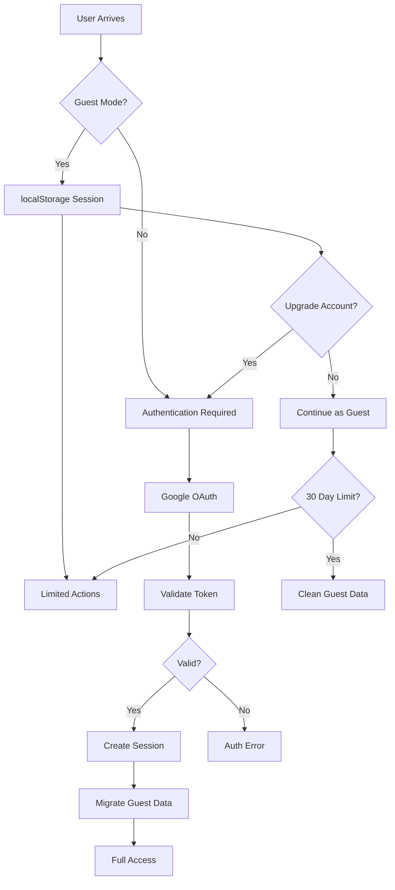

# StoryScale Security Guide

## 🔒 Security Overview

StoryScale implements defense-in-depth security with multiple layers of protection across authentication, authorization, data protection, and API security. The system supports both guest and authenticated users with seamless security model transitions.

**Security Principles:**
- **Zero Trust**: Never trust, always verify
- **Least Privilege**: Minimum required permissions
- **Defense in Depth**: Multiple security layers
- **Data Protection**: Encryption at rest and in transit
- **Audit Trail**: Complete action logging
- **Progressive Security**: Enhanced security for authenticated users

## 🔐 Authentication Architecture

### Authentication Flow


### Authentication Implementation

#### Supabase Auth Configuration
```typescript
// lib/auth.ts
import { createClient } from '@supabase/supabase-js'
import { Database } from '@/types/supabase'

const supabaseUrl = process.env.NEXT_PUBLIC_SUPABASE_URL!
const supabaseAnonKey = process.env.NEXT_PUBLIC_SUPABASE_ANON_KEY!

export const supabase = createClient<Database>(supabaseUrl, supabaseAnonKey, {
  auth: {
    autoRefreshToken: true,
    persistSession: true,
    detectSessionInUrl: true,
    flowType: 'pkce', // Proof Key for Code Exchange
  },
  global: {
    headers: {
      'X-Client-Info': 'storyscale-web',
    },
  },
})

// Auth state management
export class AuthManager {
  private static instance: AuthManager
  
  static getInstance(): AuthManager {
    if (!this.instance) {
      this.instance = new AuthManager()
    }
    return this.instance
  }
  
  // Guest session management
  async createGuestSession(): Promise<GuestSession> {
    const sessionId = crypto.randomUUID()
    const expiresAt = new Date(Date.now() + 30 * 24 * 60 * 60 * 1000) // 30 days
    
    const guestSession = {
      sessionId,
      expiresAt,
      createdAt: new Date(),
      documentCount: 0,
      researchCount: 0
    }
    
    localStorage.setItem('guest_session', JSON.stringify(guestSession))
    
    // Create guest user in database
    const { error } = await supabase
      .from('users')
      .insert({
        provider: 'guest',
        guest_session_id: sessionId,
        quota_usage: { documents: 0, research_calls: 0 }
      })
    
    if (error) {
      throw new Error(`Failed to create guest session: ${error.message}`)
    }
    
    return guestSession
  }
  
  // Google OAuth (primary authentication method)
  async signInWithGoogle(): Promise<AuthResult> {
    const { data, error } = await supabase.auth.signInWithOAuth({
      provider: 'google',
      options: {
        redirectTo: `${window.location.origin}/auth/callback`,
        queryParams: {
          access_type: 'offline',
          prompt: 'consent',
          hd: '', // Allow any domain, remove if you want to restrict to specific domains
        }
      }
    })
    
    if (error) {
      throw new Error(`Google sign-in failed: ${error.message}`)
    }
    
    // Migrate guest data if exists after successful Google auth
    if (data.user) {
      await this.migrateGuestSession(data.user.id)
    }
    
    return { success: true, data }
  }
  
  // Sign out
  async signOut(): Promise<void> {
    const { error } = await supabase.auth.signOut()
    if (error) {
      throw new Error(`Sign out failed: ${error.message}`)
    }
  }
  
  // Guest to authenticated migration
  private async migrateGuestSession(userId: string): Promise<void> {
    const guestSession = this.getGuestSession()
    if (!guestSession) return
    
    try {
      // Call migration function
      const { data, error } = await supabase.rpc('migrate_guest_to_authenticated', {
        p_guest_session_id: guestSession.sessionId,
        p_user_id: userId
      })
      
      if (error) {
        console.warn('Guest migration failed:', error)
      } else {
        // Clear guest session
        localStorage.removeItem('guest_session')
        console.log('Guest data migrated:', data)
      }
    } catch (error) {
      console.warn('Migration error:', error)
    }
  }
  
  // Session validation
  async validateSession(): Promise<boolean> {
    const { data: { session } } = await supabase.auth.getSession()
    
    if (session?.user) {
      // Authenticated user
      return true
    }
    
    // Check guest session
    const guestSession = this.getGuestSession()
    if (guestSession && new Date() < new Date(guestSession.expiresAt)) {
      return true
    }
    
    return false
  }
  
  private getGuestSession(): GuestSession | null {
    const stored = localStorage.getItem('guest_session')
    return stored ? JSON.parse(stored) : null
  }
}
```

#### Google OAuth Setup Requirements

##### Environment Variables
```bash
# Required environment variables for Google OAuth
NEXT_PUBLIC_SUPABASE_URL=https://your-project.supabase.co
NEXT_PUBLIC_SUPABASE_ANON_KEY=your-anon-key
SUPABASE_SERVICE_ROLE_KEY=your-service-role-key

# Google OAuth credentials (set in Supabase Dashboard)
# Navigate to: Authentication > Providers > Google
# Add your Google Client ID and Secret
```

##### Configuration Steps
1. **Google Cloud Console**:
   - Create project or use existing
   - Enable Google+ API
   - Create OAuth 2.0 client ID
   - Add authorized redirect URIs:
     - `https://your-project.supabase.co/auth/v1/callback`
     - `http://localhost:3000/auth/callback` (for development)

2. **Supabase Dashboard**:
   - Go to Authentication > Providers
   - Enable Google provider
   - Add Client ID and Client Secret from Google Console
   - Set redirect URL: `https://your-domain.com/auth/callback`

3. **Frontend Implementation**:
```typescript
// components/auth/GoogleSignIn.tsx
import { AuthManager } from '@/lib/auth'

export function GoogleSignInButton() {
  const auth = AuthManager.getInstance()
  
  const handleGoogleSignIn = async () => {
    try {
      await auth.signInWithGoogle()
      // Redirect happens automatically
    } catch (error) {
      console.error('Google sign-in failed:', error)
    }
  }
  
  return (
    <button 
      onClick={handleGoogleSignIn}
      className="flex items-center gap-2 px-4 py-2 border border-gray-300 rounded-md hover:bg-gray-50"
    >
      <GoogleIcon />
      Continue with Google
    </button>
  )
}
```

#### JWT Token Management
```typescript
// lib/jwt.ts
import jwt from 'jsonwebtoken'

const JWT_SECRET = process.env.JWT_SECRET!
const JWT_EXPIRES_IN = '1h'

export class TokenManager {
  // Create access token
  static createAccessToken(payload: TokenPayload): string {
    return jwt.sign(payload, JWT_SECRET, {
      expiresIn: JWT_EXPIRES_IN,
      issuer: 'storyscale',
      audience: 'storyscale-api'
    })
  }
  
  // Verify token
  static verifyToken(token: string): TokenPayload | null {
    try {
      return jwt.verify(token, JWT_SECRET) as TokenPayload
    } catch (error) {
      return null
    }
  }
  
  // Extract token from request
  static extractToken(request: Request): string | null {
    const authHeader = request.headers.get('authorization')
    if (!authHeader?.startsWith('Bearer ')) {
      return null
    }
    
    return authHeader.substring(7)
  }
  
  // Create guest token
  static createGuestToken(sessionId: string): string {
    return jwt.sign(
      { 
        sessionId, 
        type: 'guest',
        sub: `guest:${sessionId}` 
      },
      JWT_SECRET,
      { expiresIn: '30d' }
    )
  }
}

interface TokenPayload {
  sub: string // user ID or guest session ID
  type: 'user' | 'guest'
  sessionId?: string
  iat?: number
  exp?: number
}
```

## 🛡️ Authorization (RLS Implementation)

### Row Level Security Policies

#### User Access Control
```sql
-- Users can only access their own data
CREATE POLICY "users_own_data" ON users
  FOR ALL USING (
    auth.uid() = id OR 
    (provider = 'guest' AND auth.uid() IS NULL)
  );

-- Documents access with guest support
CREATE POLICY "documents_access" ON documents
  FOR SELECT USING (
    user_id = auth.uid() OR
    EXISTS (
      SELECT 1 FROM users u 
      WHERE u.id = documents.user_id 
      AND u.provider = 'guest'
      AND u.guest_session_id = current_setting('app.guest_session_id', true)
    )
  );

-- Document creation policy
CREATE POLICY "documents_create" ON documents
  FOR INSERT WITH CHECK (
    user_id = auth.uid() OR
    EXISTS (
      SELECT 1 FROM users u 
      WHERE u.id = documents.user_id 
      AND u.provider = 'guest'
      AND u.guest_session_id = current_setting('app.guest_session_id', true)
    )
  );

-- Sources access through document ownership
CREATE POLICY "sources_access" ON sources
  FOR ALL USING (
    EXISTS (
      SELECT 1 FROM documents d 
      WHERE d.id = sources.document_id 
      AND (
        d.user_id = auth.uid() OR 
        EXISTS (
          SELECT 1 FROM users u 
          WHERE u.id = d.user_id 
          AND u.provider = 'guest'
          AND u.guest_session_id = current_setting('app.guest_session_id', true)
        )
      )
    )
  );

-- Pattern learning data access
CREATE POLICY "patterns_access" ON user_patterns
  FOR ALL USING (user_id = auth.uid());

CREATE POLICY "templates_access" ON templates
  FOR ALL USING (user_id = auth.uid());
```

#### API Route Authorization
```typescript
// lib/authorization.ts
import { NextRequest } from 'next/server'
import { supabase } from './supabase'
import { TokenManager } from './jwt'

export class AuthorizationManager {
  // Middleware for API routes
  static async authorizeRequest(request: NextRequest): Promise<AuthContext> {
    // Check for authentication token
    const token = TokenManager.extractToken(request)
    
    if (token) {
      // Verify JWT token
      const payload = TokenManager.verifyToken(token)
      if (payload) {
        if (payload.type === 'user') {
          return {
            authenticated: true,
            userId: payload.sub,
            type: 'user'
          }
        } else if (payload.type === 'guest') {
          return {
            authenticated: false,
            sessionId: payload.sessionId!,
            type: 'guest'
          }
        }
      }
    }
    
    // Check Supabase session
    const { data: { session } } = await supabase.auth.getSession()
    if (session?.user) {
      return {
        authenticated: true,
        userId: session.user.id,
        type: 'user',
        session
      }
    }
    
    // Check guest session header
    const guestSessionId = request.headers.get('x-guest-session')
    if (guestSessionId) {
      const isValid = await this.validateGuestSession(guestSessionId)
      if (isValid) {
        return {
          authenticated: false,
          sessionId: guestSessionId,
          type: 'guest'
        }
      }
    }
    
    throw new Error('Unauthorized access')
  }
  
  // Validate guest session
  private static async validateGuestSession(sessionId: string): Promise<boolean> {
    const { data, error } = await supabase
      .from('guest_sessions')
      .select('expires_at')
      .eq('session_id', sessionId)
      .single()
    
    if (error || !data) {
      return false
    }
    
    return new Date() < new Date(data.expires_at)
  }
  
  // Check resource ownership
  static async canAccessDocument(userId: string, documentId: string): Promise<boolean> {
    const { data, error } = await supabase
      .from('documents')
      .select('user_id')
      .eq('id', documentId)
      .single()
    
    if (error || !data) {
      return false
    }
    
    return data.user_id === userId
  }
  
  // Check quota limits
  static async checkQuotaLimit(
    userId: string, 
    resource: 'documents' | 'research_calls',
    limit: number
  ): Promise<boolean> {
    const { data, error } = await supabase
      .from('users')
      .select('quota_usage, subscription_tier')
      .eq('id', userId)
      .single()
    
    if (error || !data) {
      return false
    }
    
    const usage = data.quota_usage[resource] || 0
    const tierLimit = this.getTierLimit(data.subscription_tier, resource)
    
    return usage < Math.min(limit, tierLimit)
  }
  
  private static getTierLimit(tier: string, resource: string): number {
    const limits = {
      free: { documents: 10, research_calls: 50 },
      pro: { documents: Infinity, research_calls: 500 },
      enterprise: { documents: Infinity, research_calls: Infinity }
    }
    
    return limits[tier]?.[resource] || 0
  }
}

interface AuthContext {
  authenticated: boolean
  userId?: string
  sessionId?: string
  type: 'user' | 'guest'
  session?: any
}
```

## 🔐 Data Protection

### Encryption at Rest
```typescript
// lib/encryption.ts
import crypto from 'crypto'

const ENCRYPTION_KEY = process.env.ENCRYPTION_KEY! // 32 characters
const ALGORITHM = 'aes-256-gcm'

export class EncryptionManager {
  // Encrypt sensitive data before storing
  static encrypt(text: string): EncryptedData {
    const iv = crypto.randomBytes(16)
    const cipher = crypto.createCipher(ALGORITHM, ENCRYPTION_KEY)
    cipher.setAAD(Buffer.from('storyscale-data'))
    
    let encrypted = cipher.update(text, 'utf8', 'hex')
    encrypted += cipher.final('hex')
    
    const authTag = cipher.getAuthTag()
    
    return {
      encrypted,
      iv: iv.toString('hex'),
      authTag: authTag.toString('hex')
    }
  }
  
  // Decrypt sensitive data after retrieval
  static decrypt(encryptedData: EncryptedData): string {
    const decipher = crypto.createDecipher(ALGORITHM, ENCRYPTION_KEY)
    decipher.setAAD(Buffer.from('storyscale-data'))
    decipher.setAuthTag(Buffer.from(encryptedData.authTag, 'hex'))
    
    let decrypted = decipher.update(encryptedData.encrypted, 'hex', 'utf8')
    decrypted += decipher.final('utf8')
    
    return decrypted
  }
  
  // Hash passwords (using bcrypt for better security)
  static async hashPassword(password: string): Promise<string> {
    const bcrypt = await import('bcrypt')
    return bcrypt.hash(password, 12)
  }
  
  // Verify password hash
  static async verifyPassword(password: string, hash: string): Promise<boolean> {
    const bcrypt = await import('bcrypt')
    return bcrypt.compare(password, hash)
  }
}

interface EncryptedData {
  encrypted: string
  iv: string
  authTag: string
}
```

### Data Sanitization
```typescript
// lib/sanitization.ts
import DOMPurify from 'isomorphic-dompurify'

export class DataSanitizer {
  // Sanitize HTML content
  static sanitizeHtml(html: string): string {
    return DOMPurify.sanitize(html, {
      ALLOWED_TAGS: ['b', 'i', 'em', 'strong', 'p', 'br', 'ul', 'ol', 'li'],
      ALLOWED_ATTR: []
    })
  }
  
  // Sanitize user input
  static sanitizeUserInput(input: string): string {
    return input
      .trim()
      .replace(/[<>]/g, '') // Remove HTML brackets
      .replace(/javascript:/gi, '') // Remove javascript: protocol
      .replace(/on\w+=/gi, '') // Remove event handlers
      .substring(0, 5000) // Limit length
  }
  
  // Sanitize for SQL (though we use parameterized queries)
  static sanitizeForDatabase(input: string): string {
    return input
      .replace(/'/g, "''") // Escape single quotes
      .replace(/;/g, '') // Remove semicolons
      .replace(/--/g, '') // Remove SQL comments
      .replace(/\/\*/g, '') // Remove multiline comment start
      .replace(/\*\//g, '') // Remove multiline comment end
  }
  
  // Validate email format
  static isValidEmail(email: string): boolean {
    const emailRegex = /^[^\s@]+@[^\s@]+\.[^\s@]+$/
    return emailRegex.test(email) && email.length <= 254
  }
  
  // Validate URLs
  static isValidUrl(url: string): boolean {
    try {
      const urlObj = new URL(url)
      return ['http:', 'https:'].includes(urlObj.protocol)
    } catch {
      return false
    }
  }
  
  // Remove sensitive information from logs
  static sanitizeForLogging(data: any): any {
    const sensitiveKeys = ['password', 'token', 'key', 'secret', 'api_key']
    const sanitized = { ...data }
    
    Object.keys(sanitized).forEach(key => {
      if (sensitiveKeys.some(sensitive => key.toLowerCase().includes(sensitive))) {
        sanitized[key] = '[REDACTED]'
      }
    })
    
    return sanitized
  }
}
```

## 🚨 API Security

### Rate Limiting
```typescript
// lib/rate-limiting.ts
import { Redis } from '@upstash/redis'
import { NextRequest } from 'next/server'

const redis = new Redis({
  url: process.env.UPSTASH_REDIS_REST_URL!,
  token: process.env.UPSTASH_REDIS_REST_TOKEN!,
})

export class RateLimiter {
  // IP-based rate limiting
  static async checkIpRateLimit(
    request: NextRequest,
    limit: number = 100,
    windowMs: number = 60000
  ): Promise<RateLimitResult> {
    const ip = this.getClientIP(request)
    const key = `rate_limit:ip:${ip}`
    
    return this.checkRateLimit(key, limit, windowMs)
  }
  
  // User-based rate limiting
  static async checkUserRateLimit(
    userId: string,
    endpoint: string,
    limit: number = 50,
    windowMs: number = 60000
  ): Promise<RateLimitResult> {
    const key = `rate_limit:user:${userId}:${endpoint}`
    
    return this.checkRateLimit(key, limit, windowMs)
  }
  
  // AI API rate limiting (expensive operations)
  static async checkAiRateLimit(
    userId: string,
    limit: number = 10,
    windowMs: number = 60000
  ): Promise<RateLimitResult> {
    const key = `rate_limit:ai:${userId}`
    
    return this.checkRateLimit(key, limit, windowMs)
  }
  
  private static async checkRateLimit(
    key: string,
    limit: number,
    windowMs: number
  ): Promise<RateLimitResult> {
    const window = Math.floor(Date.now() / windowMs)
    const windowKey = `${key}:${window}`
    
    const current = await redis.incr(windowKey)
    
    if (current === 1) {
      await redis.expire(windowKey, Math.ceil(windowMs / 1000))
    }
    
    const remaining = Math.max(0, limit - current)
    const resetTime = (window + 1) * windowMs
    
    return {
      success: current <= limit,
      limit,
      remaining,
      resetTime,
      current
    }
  }
  
  private static getClientIP(request: NextRequest): string {
    // Check various headers for the real IP
    const xForwardedFor = request.headers.get('x-forwarded-for')
    const xRealIp = request.headers.get('x-real-ip')
    const cfConnectingIp = request.headers.get('cf-connecting-ip')
    
    if (xForwardedFor) {
      return xForwardedFor.split(',')[0].trim()
    }
    
    return xRealIp || cfConnectingIp || '127.0.0.1'
  }
}

interface RateLimitResult {
  success: boolean
  limit: number
  remaining: number
  resetTime: number
  current: number
}
```

### Input Validation Middleware
```typescript
// lib/validation.ts
import { z } from 'zod'
import { NextRequest, NextResponse } from 'next/server'

export class ValidationMiddleware {
  // Validate request body
  static validate<T>(schema: z.ZodSchema<T>) {
    return async (request: NextRequest): Promise<T> => {
      try {
        const body = await request.json()
        return schema.parse(body)
      } catch (error) {
        if (error instanceof z.ZodError) {
          throw new ValidationError('Invalid request data', error.errors)
        }
        throw new Error('Invalid JSON in request body')
      }
    }
  }
  
  // Common validation schemas
  static schemas = {
    createDocument: z.object({
      content: z.string().min(1).max(5000),
      purpose: z.enum(['thought-leadership', 'question', 'value', 'authority']),
      format: z.enum(['story', 'insight', 'list', 'howto', 'question']),
      tone: z.enum(['professional', 'casual', 'friendly', 'authoritative']),
      targetAudience: z.string().min(1).max(100),
      enableResearch: z.boolean().optional(),
      urlReference: z.string().url().optional()
    }),
    
    // Google OAuth handles user registration automatically
    // No manual registration validation needed
    
    researchQuery: z.object({
      topic: z.string().min(1).max(500),
      providers: z.array(z.enum(['firecrawl', 'tavily'])).optional(),
      maxSources: z.number().int().min(1).max(10).optional()
    })
  }
}

class ValidationError extends Error {
  constructor(message: string, public errors: z.ZodIssue[]) {
    super(message)
    this.name = 'ValidationError'
  }
}
```

### CSRF Protection
```typescript
// lib/csrf.ts
import crypto from 'crypto'
import { NextRequest } from 'next/server'

export class CSRFProtection {
  private static readonly TOKEN_LENGTH = 32
  private static readonly HEADER_NAME = 'x-csrf-token'
  private static readonly COOKIE_NAME = 'csrf-token'
  
  // Generate CSRF token
  static generateToken(): string {
    return crypto.randomBytes(this.TOKEN_LENGTH).toString('hex')
  }
  
  // Validate CSRF token
  static validateToken(request: NextRequest): boolean {
    const headerToken = request.headers.get(this.HEADER_NAME)
    const cookieToken = request.cookies.get(this.COOKIE_NAME)?.value
    
    if (!headerToken || !cookieToken) {
      return false
    }
    
    // Constant-time comparison to prevent timing attacks
    return crypto.timingSafeEqual(
      Buffer.from(headerToken, 'hex'),
      Buffer.from(cookieToken, 'hex')
    )
  }
  
  // Check if CSRF protection is needed
  static requiresCSRFProtection(method: string): boolean {
    return ['POST', 'PUT', 'PATCH', 'DELETE'].includes(method.toUpperCase())
  }
}
```

## 🛡️ Content Security Policy

### CSP Implementation
```typescript
// middleware.ts
import { NextResponse } from 'next/server'
import type { NextRequest } from 'next/server'

export function middleware(request: NextRequest) {
  const response = NextResponse.next()
  
  // Content Security Policy
  const csp = [
    "default-src 'self'",
    "script-src 'self' 'unsafe-eval' 'unsafe-inline' *.googleapis.com *.stripe.com",
    "style-src 'self' 'unsafe-inline' *.googleapis.com",
    "img-src 'self' data: blob: *.supabase.co",
    "font-src 'self' *.googleapis.com *.gstatic.com",
    "connect-src 'self' *.supabase.co *.stripe.com api.openai.com api.anthropic.com",
    "frame-src 'none'",
    "object-src 'none'",
    "base-uri 'self'",
    "form-action 'self'",
    "frame-ancestors 'none'"
  ].join('; ')
  
  response.headers.set('Content-Security-Policy', csp)
  
  // Other security headers
  response.headers.set('X-Frame-Options', 'DENY')
  response.headers.set('X-Content-Type-Options', 'nosniff')
  response.headers.set('Referrer-Policy', 'origin-when-cross-origin')
  response.headers.set('Permissions-Policy', 'camera=(), microphone=(), geolocation=()')
  
  // HSTS (HTTP Strict Transport Security)
  if (process.env.NODE_ENV === 'production') {
    response.headers.set(
      'Strict-Transport-Security',
      'max-age=31536000; includeSubDomains; preload'
    )
  }
  
  return response
}
```

## 📋 Security Monitoring

### Security Event Logging
```typescript
// lib/security-monitoring.ts
export class SecurityMonitor {
  // Log authentication events
  static async logAuthEvent(event: AuthEvent): Promise<void> {
    const securityEvent = {
      type: 'auth',
      event: event.type,
      userId: event.userId,
      ip: event.ip,
      userAgent: event.userAgent,
      success: event.success,
      timestamp: new Date(),
      metadata: event.metadata
    }
    
    await this.logSecurityEvent(securityEvent)
    
    // Alert on suspicious activity
    if (this.isSuspiciousAuthActivity(event)) {
      await this.alertSecurityTeam(securityEvent)
    }
  }
  
  // Log API access events
  static async logApiAccess(event: ApiAccessEvent): Promise<void> {
    const securityEvent = {
      type: 'api_access',
      endpoint: event.endpoint,
      method: event.method,
      userId: event.userId,
      ip: event.ip,
      statusCode: event.statusCode,
      responseTime: event.responseTime,
      timestamp: new Date()
    }
    
    await this.logSecurityEvent(securityEvent)
  }
  
  // Log data access events
  static async logDataAccess(event: DataAccessEvent): Promise<void> {
    const securityEvent = {
      type: 'data_access',
      resource: event.resource,
      action: event.action,
      userId: event.userId,
      resourceId: event.resourceId,
      success: event.success,
      timestamp: new Date()
    }
    
    await this.logSecurityEvent(securityEvent)
  }
  
  private static async logSecurityEvent(event: SecurityEvent): Promise<void> {
    // Store in database
    await supabase.from('security_logs').insert(event)
    
    // Send to external monitoring service
    if (process.env.NODE_ENV === 'production') {
      await fetch(process.env.SECURITY_WEBHOOK_URL!, {
        method: 'POST',
        headers: { 'Content-Type': 'application/json' },
        body: JSON.stringify(event)
      }).catch(console.warn)
    }
  }
  
  private static isSuspiciousAuthActivity(event: AuthEvent): boolean {
    // Multiple failed attempts
    if (!event.success && event.metadata?.failedAttempts > 5) {
      return true
    }
    
    // Login from unusual location
    if (event.success && event.metadata?.unusualLocation) {
      return true
    }
    
    // Rapid authentication attempts
    if (event.metadata?.rapidAttempts > 10) {
      return true
    }
    
    return false
  }
  
  private static async alertSecurityTeam(event: SecurityEvent): Promise<void> {
    // Send alert to security team
    const alert = {
      severity: 'high',
      type: event.type,
      message: `Suspicious activity detected: ${event.event}`,
      details: event,
      timestamp: new Date()
    }
    
    // Integration with alerting system (Slack, PagerDuty, etc.)
    await fetch(process.env.SECURITY_ALERT_WEBHOOK!, {
      method: 'POST',
      headers: { 'Content-Type': 'application/json' },
      body: JSON.stringify(alert)
    }).catch(console.warn)
  }
}

interface AuthEvent {
  type: 'login' | 'logout' | 'registration' | 'password_reset'
  userId?: string
  ip: string
  userAgent: string
  success: boolean
  metadata?: Record<string, any>
}

interface ApiAccessEvent {
  endpoint: string
  method: string
  userId?: string
  ip: string
  statusCode: number
  responseTime: number
}

interface DataAccessEvent {
  resource: string
  action: 'create' | 'read' | 'update' | 'delete'
  userId: string
  resourceId: string
  success: boolean
}
```

## 🔐 Security Testing

### Security Test Suite
```typescript
// tests/security.test.ts
import { describe, it, expect } from '@jest/globals'
import { AuthManager, TokenManager, RateLimiter } from '../lib/security'

describe('Security Systems', () => {
  describe('Authentication', () => {
    it('should create valid guest session', async () => {
      const auth = AuthManager.getInstance()
      const session = await auth.createGuestSession()
      
      expect(session.sessionId).toBeDefined()
      expect(session.expiresAt).toBeInstanceOf(Date)
      expect(session.documentCount).toBe(0)
    })
    
    it('should validate JWT tokens correctly', () => {
      const payload = { sub: 'user123', type: 'user' }
      const token = TokenManager.createAccessToken(payload)
      const decoded = TokenManager.verifyToken(token)
      
      expect(decoded?.sub).toBe('user123')
      expect(decoded?.type).toBe('user')
    })
    
    it('should reject invalid tokens', () => {
      const decoded = TokenManager.verifyToken('invalid.token.here')
      expect(decoded).toBeNull()
    })
  })
  
  describe('Rate Limiting', () => {
    it('should enforce rate limits', async () => {
      const mockRequest = new Request('http://localhost/api/test')
      
      // Make requests up to limit
      for (let i = 0; i < 5; i++) {
        const result = await RateLimiter.checkIpRateLimit(mockRequest, 5, 60000)
        expect(result.success).toBe(true)
      }
      
      // Next request should be blocked
      const blockedResult = await RateLimiter.checkIpRateLimit(mockRequest, 5, 60000)
      expect(blockedResult.success).toBe(false)
    })
  })
  
  describe('Data Sanitization', () => {
    it('should sanitize HTML input', () => {
      const maliciousHtml = '<script>alert("xss")</script><p>Safe content</p>'
      const sanitized = DataSanitizer.sanitizeHtml(maliciousHtml)
      
      expect(sanitized).not.toContain('<script>')
      expect(sanitized).toContain('<p>Safe content</p>')
    })
    
    it('should validate email addresses', () => {
      expect(DataSanitizer.isValidEmail('valid@example.com')).toBe(true)
      expect(DataSanitizer.isValidEmail('invalid.email')).toBe(false)
      expect(DataSanitizer.isValidEmail('')).toBe(false)
    })
  })
})
```

## 📋 Security Checklist

### Pre-deployment Security Review
- [ ] All API endpoints have authentication
- [ ] RLS policies are properly configured
- [ ] Input validation is comprehensive
- [ ] Rate limiting is implemented
- [ ] CSRF protection is active
- [ ] Security headers are configured
- [ ] Sensitive data is encrypted
- [ ] Audit logging is functional
- [ ] Error messages don't leak information
- [ ] Dependencies are up to date

### Production Security Monitoring
- [ ] Security event logging is active
- [ ] Suspicious activity alerts are configured
- [ ] Rate limit violations are monitored
- [ ] Authentication failures are tracked
- [ ] Data access is audited
- [ ] API usage is monitored
- [ ] Performance anomalies are detected
- [ ] Security patches are automated

### Incident Response Plan
1. **Detection**: Automated alerts and monitoring
2. **Assessment**: Evaluate severity and impact
3. **Containment**: Isolate affected systems
4. **Eradication**: Remove security threats
5. **Recovery**: Restore normal operations
6. **Lessons Learned**: Document and improve

---

*This security documentation is connected to:*
- *[architecture.md](./architecture.md) - Security architecture overview*
- *[api.md](./api.md) - API security implementation*
- *[database.md](./database.md) - Database security and RLS*
- *[deployment.md](./deployment.md) - Production security configuration*